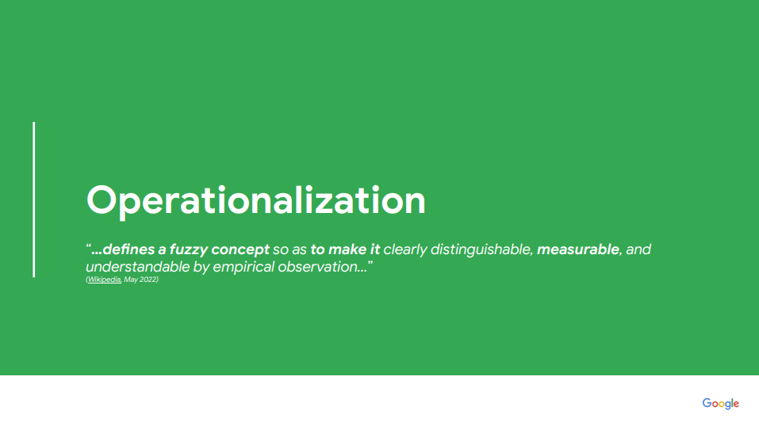
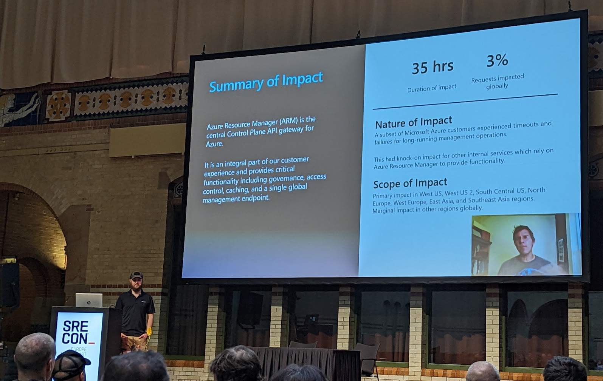
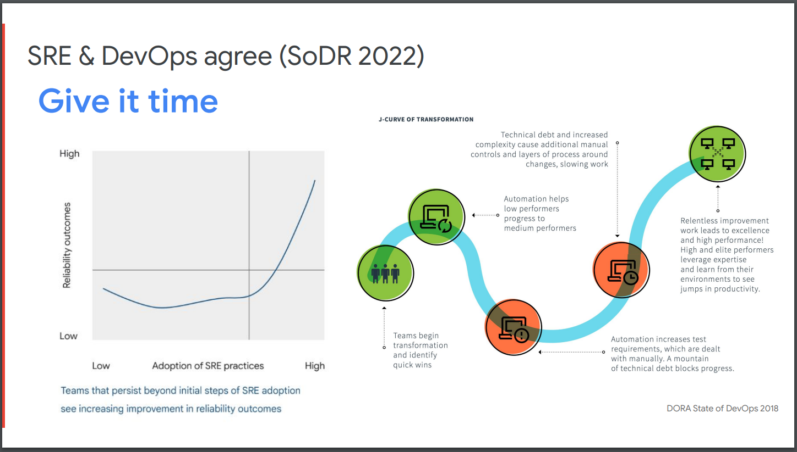

## Introduction

At the start of October i attended, along with many other SREs, SREcon 2022 EMEA
in Amsterdam.

This post is some notes and references from the talks i attended. I suggest
watching the actual talks to actually understand and learn from.

### Conference Theme

SREcon 2022 had a theme of
["What could SRE be?"](https://www.usenix.org/conference/srecon22emea/call-for-participation).
The Conference committee wanted to encourage a "forward-looking" conversations.
This was in the hope to try to help establish a pathway forward for the
industry. But true to form you cant look forward with out looking at where we
are currently and where we came from.

The re-occurring message that every speaker decided to also bring was that of
the SRE book being aspirational. It was written cherry-picking the best of the
best from google. It was not a prescriptive guide that everyone must follow to
be considered an SRE. This sentiment was not shared at the time of release and
unsurprisingly this has caused some friction.

### Amsterdam

Completely coincidentally, this year's Call of Duty launch has a level in
Amsterdam - see the [Walk through](https://www.youtube.com/watch?v=X_LlSR6-ibA).

So of course we had to go visit the area for lunch, and because most of the
restaurants happened to be in the area.

(Captain Price is cropped out of the right for operational security.)

### Some of the biggest insights and takeaways

(In no particular order)

"SRE is what happens when you ask a software engineer to design an operation
team". A concept mentioned in multiple talks. Operational tasks don't just
disappear overnight and firing everyone who can't code equals bad things
happening.

Superheroes are universally viewed as a bad thing. The issue gets worse the more
management calls out people for achievements during times of pressure as it
encourages more times of pressure to demonstrate value. Worse if heroes operate
in incidents or on call as this can block others from learning critical
information. See
[Is Our Team as Resilient as Our Systems?](#is-our-team-as-resilient-as-our-systems)
for more.

### Quick reference

(Again in no particular order)

- [Oncall: An Equal Opportunity Waste of Time](#oncall-an-equal-opportunity-waste-of-time) -
  Not just on call, but a good overview of how work repeats itself based on past
  performance.
- [Over Nine Billion Dollars of SRE Lessons - the James Webb Space Telescope](#over-nine-billion-dollars-of-sre-lessons---the-james-webb-space-telescope) -
  Not an SRE and wanted to know what the principles are? Or just like Lego or
  space, this is the one for you.
- [How We Implemented High Throughput Logging at Spotify](#how-we-implemented-high-throughput-logging-at-spotify) -
  Due to the log volumes on their container infrastructure, Spotify ran into the
  hard limits of fluentd. This talk details their journey to more performant log
  ingestion with fluentbit.
- [Deep Dive: Azure Resource Manager Outage](#deep-dive-azure-resource-manager-outage) -
  Benjamin Pannell of ex-Demonware fame gave a great talk, worth watching for
  anyone who has ever had to deal with systems that pull from a queue.
- [Passing the Torch - Building a New Grad Program to Mentor the Next Generation of SRE](#passing-the-torch---building-a-new-grad-program-to-mentor-the-next-generation-of-sre) -
  for anyone involved in onboarding or mentorship, especially those with junior
  level or interns. It covers many areas that are just assumed knowledge that
  people in their first jobs rarely have.
- [SRE as She Is Spoke](#sre-as-she-is-spoke) - "Good SRE copy. Great SRE
  steal".
- [Break Free of the Template: Incident Writeups They Want to Read](#break-free-of-the-template-incident-writeups-they-want-to-read) -
  Incident Write ups should be a learning opportunity not box ticking. People
  should enjoy reading them.

### Table of Contents



## Tuesday, 25 October

### Opening Remarks

> Daria Barteneva, Microsoft, and Niall Murphy, Stanza

Talked through the theme of the conference around what is SRE and what it could
be. It understandably opened on a positive and hopeful note.

They are the someone in someone should do something.

They are a force multiplier, the glue to allow people to do things, helping
everyone else scale.

### Knowledge and Power: A Sociotechnical Systems Discussion on the Future of SRE

> [Dr. Laura Maguire, Jeli, and Lorin Hochstein, Netflix.](https://www.usenix.org/conference/srecon22emea/presentation/maguire)

Knowledge itself is power. Those who have it can control the events.

Organisational knowledge can be lost from employee churn if not handled
correctly. The more stable a system is, the more likely this can happen too.
Everyone's knowledge is different and fragments of the whole system. We hold
these partially incomplete pieces of knowledge in our head and to gain a full
understanding of our systems we need to pull this knowledge across multiple
different domains and people.

In incidents, small, seemingly meaningless things can combine together to result
in bad things happening. There was a good walk through of a Netflix outage where
a migration removed a small wait state resulting in an outage. The user who had
originally added the wait had left so the knowledge behind the wait was lost.
I'm not sure why there wasn't a comment on the wait and it wasn't mentioned
either.

The ability to recall what we know is key and can be gained from storytelling
about incidents. Create detailed vivid incidents reports, ask targeted questions
to draw out what you've not shared.

SREs, and engineers in general, all have different knowledge and experience.
This colours how people will see a system or incident meaning everyone's via
will be partial and incomplete. Working together we can build up a more complete
view of the system. Important as people generally don't know how they know
things, especially during incidents.

The last part of the talk covered making changes in the organisation and how
just because you are an expert in your field does not mean you can make changes
in it. Management are finite local so can and will only pay attention to so much
given the limited hours in the day. It also means proximity tends to play an
outside impact on this. Think those who shout the loudest get listened to.

Related to this is the implicit incentives that organisations place on things.
OKRs will directly influence where people focus their efforts however some
things do follow on to a point. If your system isn't reliable "enough", the OKRs
won't matter. But if you don't do the OKRs, the reliability won't matter either.

The talk ended by looping back towards organisational knowledge and how by
increasing reliability you end up with few incidents, and these incidents will
trend to being more complex. This will leave people less prepared to deal with
them just from lack of experience. Ops is a muscle. Over abstractions can lead
to this muscle weakening, and the obvious realities are the hardest to see, it's
our jobs as SRE to surface them.

### SRE as She Is Spoke

> [Andrew Clay Shafer](https://www.usenix.org/conference/srecon22emea/presentation/shafer)

There is power in language and the narratives we tell. The language we choose to
use shapes how we think about problems. If we don't use clear language to
communicate a problem people will never truly understand the problem and when
engineers implement a solution without understanding it will unsurprisingly
fail.

Engineers need to be at a level of fluency in their problem domains to
communicate effectively. This fluency that comes from experience, it's not
something that can be bought. People will build fluency to their level of
necessity, once their needs are met progress will stop.

The Language of our domains allow us to effectively communicate with each other.
The more fluent we are in these shared languages the easier it will be for us to
share our problems and learnings with one another.

Take away from this talk is "Good SRE copy. Great SRE steal"

### Oncall: An Equal Opportunity Waste of Time

> [Dave O'Connor, Twilio](https://www.usenix.org/conference/srecon22emea/presentation/oconnor)

There are some pretty important points here such that anyone who has any control
over their own work should watch it. If you are oncall or control oncall, it can
be considered a must watch.

One of the core points is how as engineers, the reward for good work is simply
more work. In a general sense, you want to be doing different work next year
than you are doing today - because you have automated away today's work enough
that it is no longer a concern.

Combined together, this leads to a very strong balancing act around the type of
work you should be taking on and how it fits into core SRE principals.

From the oncall perspective itself, remembering that there is a difference
between a waste of time and a bad idea. Oncall does cause impact, to your
timelines, your team, your coworkers, your own sanity, and that impact is
generally a waste of time in that nothing truly productive comes from it. But
oncall itself isn't a bad idea. No matter how much automation magic you build,
shit happens and someday, sometime, something unexpected will happen and oncall
will need to fix it.

The balancing act continues when staffing oncall as well. Oncall itself
shouldn't be scary, however if the team is well run, removing tasks and changing
the general nature of responsibilities over time, each new oncaller will have a
different experience and will know different, if not also less things. As 90%
solutions can remove a task from oncall leaving only the awkward edge cases, it
is important to understand this is fine, prepare the runbooks and escalation
paths for when required. You want to aim for something manageable, not easy.

### Measuring Reliability: What Got Us Here Won't Get Us There

> [Štěpán Davidovič, Google](https://www.usenix.org/conference/srecon22emea/presentation/davidovic)

A standing room only talk which gave some obvious in highsight views on SLO and
reliability measuring. So obvious, most people fall into the same pitfalls.

It covered how reliability is a lagging indicator, monitoring what has happened,
not what will happen or even what is currently happening as it watches the,
typically, time series data.

When aggregation is used, and it must be used, it will hide a lot of
information. You could have 99.999% of requests working, but those that are
failing are for a subset of users. Those users will be having a pretty bad
experience while you think the app is functioning fine. Similarly a single 1000
minute outage will impact users much differently than 1000 1 minute outages
depending on your application.

Asking if SLO/SLIs are good is the wrong question. They are purely a tool,
providing information around the questions you ask of them. You should match
your tool to the problem, don't start with the tool and match the problem.

### Crayon Drawing Is a Vital Engineering Skill

> [Murali Suriar, Snowflake](https://www.usenix.org/conference/srecon22emea/presentation/suriar-crayon)

Every engineer when asked to create a diagram of a system will create a
different drawing to each other. These diagrams are often created in isolation
and can appear confusing to someone coming in cold. Creating standard diagrams
of your systems together as a team builds a shared understanding of your
systems.

We shouldn't strive for 100% accuracy in all our diagrams, but rather they
should be consistent and show the important components at a high level.

This practice has positive effects:

- Improve the onboarding experience for new team members
- Ability to reason about our systems together
- Understand the impact of proposed changes

Mermaid.js inline drawing tool, you can add these to your markdown:
[mermaid.live](https://mermaid.live)

### Building Dynamic Configuration into Terraform

> [Isabelle Miller and Hosh Sadiq, LaunchDarkly](https://www.usenix.org/conference/srecon22emea/presentation/miller)

LaunchDarkly talked through the issues they faced using terraform to manage
their ever growing infrastructure. Scaling resources and changing settings by
hand become a laborious task given the large config repos.

They talked about how they simplified their usage of terraform by outsourcing
configuration and resource management by creating a custom terraform resource so
they could leverage their own configuration management service. Once they had
this set up they simplified their deployment pipeline and made their engineers
more efficient.

### Hunting for Risky Dependencies in the World of Microservices

> [Theo Klein, Google LLC](https://www.usenix.org/conference/srecon22emea/presentation/klein)

A story from google talking about how they used distributed tracing to track
down unintended dependencies in their system. During investigation into the
reliability of their Maps service they discovered specific calls from a service
on the critical path was hitting a service with unreliable 9s.

Once they discovered this they managed to rework the call path to use a more
reliable service. They found multiple other occurrences of this using tracing
and eventually remediated them all with a combination of migrating to more
reliable service, making calls optionals or deprecating the services

### How We Implemented High Throughput Logging at Spotify

> [Lauren Muhlhauser, Spotify](https://www.usenix.org/conference/srecon22emea/presentation/muhlhauser)

This talk was eerily similar to the issues we've encountered in our logs stack.
Everyone encounters the same problems sooner or later. Collecting and storing
100% of the data can be very expensive for high traffic services.

Spotify initially used FluentD to ship logs from their containers on GKE into
GCP's log storage solution, GCL. Once they hit >1700 namespaces things started
to go south and FluentD was maxed out. Resulting in delayed or simply dropped
logs, they did not really have a clear picture of how much data was being lost
(which became important later)

Migrating to the more performant, multithreaded FluentBit resulted in much more
efficient log shipping.

It was not without its problems, however

- OOM issues with some versions of FluentBit
- Limit of 256 outputs
- Worked too well once the true volume of logs began to get shipped to GCL and
  costs increased

Automated sampling of logs:

- GCP check monitors for high throughput in a project
- The alert is sent to a pubsub which is monitored by their sampling service
- The service automatically drops sampling to 10% and notifies the user

Consider if logs are the appropriate solution for your service and look at
alternatives such as metrics or tracing.

Purposeful logging: Is this log information immediately useful in some way, and
will it provide the details I need to understand the underlying cause and make
decisions?

### Life after The Chocolate Factory

> [Murali Suriar, Snowflake, and Emil Stolarsky, Wave Mobile Money](https://www.usenix.org/conference/srecon22emea/presentation/suriar-chocolate)

This talk is about life after working at a FAANG type company and how engineers
will sometimes feel like stepping back to another planet as everything is so
different.

It is a truly amazing intro. No words other than just watch it.

There are lessons to be had from the larger companies. While they do have
hundreds or thousands of people following their processes like onboarding, you
too can follow and update it. As a new user, small things that don't work are a
new level of painful. Onboarders should not have to tweak or configure things to
get the initial bits setup. To achieve this it is important for continuous
improvement, feeding back everything to the documentation. It is likely the
mentor needs to do it as the new person will not know what they don't know.

Transparency matters too. Failing clearly and obviously will help your engineers
who should be focused on adding value not trying to figure out how to login to
system X.

Code reflects the organisation, and the organisation reflects Jira. Yes the Jira
hate was a continual theme throughout however a number of good points were made
on how it has an outsized impact on projects.

### Is Our Team as Resilient as Our Systems?

> [Effie Mouzeli, Wikimedia Foundation.](https://www.usenix.org/conference/srecon22emea/presentation/mouzeli)

We tend to build resistant systems, where the loss of a node is routine, but
rarely apply this to teams. Some of it is down to the scale of the team itself,
and some to the incremental cost of adding more people. The talk covers how the
hero culture that exists at times directly impacts this, creating a low bus
factor.

Right from the onboarding process, teams and organisations tend to create a
feedback loop where more experienced people get more experienced and newer
people struggle to catch up. The different skill levels and backgrounds mean an
engineer will experience the process differently but we would rarely go improve
the process to help account for the difference. Lots of time we turn the gaps
into tribal knowledge, sharing the undocumented bits via word of mouth.

On more established teams, you will start to see generational gaps between the
people who joined at different times. Similar generations will have built up
similar habits. This is even more pronounced when normal automation principles
are applied as entire blocks of knowledge can be lost as there will be no need
to transfer them as the tasks get automated away.

Superhero culture is a serious problem. The superheros pick up more work. Work
hard. Define the direction. This can unwillingly prevent growth of the team or
organisation. Worse, when these heroes eventually move on the gap left behind
can be giant. Instead of simply looking for a single person to replace them, you
might realistically be looking for 2 or 3 people just to make up the skill sets.

Mentorship is good. It needs sponsorship and incentives. No one has ever been
promoted for mentoring people. While it directly contributes to shared
knowledge, levelling up both engineers involved, and assists in the creation of
human connection and trust. Management needs to recognise the effort and
compensate it accordingly given the benefits it can bring to the company.

### What SRE Could Be: Systems Reliability Engineering

> [Laura Nolan, Stanza](https://www.usenix.org/conference/srecon22emea/presentation/nolan-sre)

SRE is having an identity crisis. There is a lot of ritual without reason. Just
because is not a reason to do.

The talk progresses through the underlying concepts of systems design, and how
standardised problems and the building block which progress comes from.

While the industry can standardise, there are slight differences in every
system - different quirks so cookie cutter solutions will rarely be drop-in.
This is more important in the context of dynamic systems. They have a moving
state and may not be the same next week as they are this week.

SRE is more than the tools we use, it is understanding systems and making
appropriate interventions to make them function better. Fixing problems before
they become problems.

SRE itself is changing too. We are not astronauts anymore, we are mission
control. As the complexity increases, we are building the systems that manage
the systems that run our systems. We've started to become abstracted away from
the abstractions and layers we used to build.

There was also a section on how modelling a system will produce different views,
from different people or at different times. Just because they are different
doesn't mean they are wrong. Different information is required when looking at a
problem from a different view.

These systems models can then be used for risk analysis and to fill in the gaps
our current data models have.

Some book recommendations from the talk

- Handbook of systems thinking methods.
- Thinking in systems
- Engineering a safer world

## Wednesday, 26 October

### Diamonds with Flaws: Examining the Pressures, Realities, and Future of Site Reliability Engineering

> [Alex Hidalgo, Nobl9](https://www.usenix.org/conference/srecon22emea/presentation/hidalgo)

Alex's talk is almost like therapy for any non FAANG engineer in the industry.
It covers what people think SRE is and what is not. Truth is SRE is and do a Lot
of things.

You shouldn't feel bad for not being the newest or fastest. Your solution could
be the best solution for your situation. However this doesn't mean you shouldn't
still try to improve.

While we always see the behemoth that the FAANGs are, if you add up all the
engineers across all the companies, FAANGs are less than 1% of the industry now.
Yet they have had an outsized impact, and not all of it good. They can still be
a source of inspiration though.

The second part of the talk focused on some questions around if we, as an
industry, could try to establish some common principles. The speaker took the
view that we could probably agree on the principles but definitely not on how to
actually implement them everywhere, something I agree with.

### How We Drained Every Backbone Router Simultaneously

> [Francois Richard, Meta](https://www.usenix.org/conference/srecon22emea/presentation/janardhan)

This talk was about the large outage on 4th Oct 2021 where everything Facebook
related went off line for a number of hours.

While the underlying cause of the routers draining incorrectly wasn't covered
well, there are a number of learning points in the talk. They had never
anticipated that they would lose all access to all data centres like this which
led to some comical failures like their access control into the datacenters
failed as it couldn't access the central network. Similarly their out of band
access also failed as it assumed some domains would be online but those had
disappeared when all the DNS servers fell off the internet.

COVID had helped lower the scale of the outage as they had implemented different
DEFCONs switches which let them reduce the load across the stack when they
restarted the traffic. Because of the longer outage, things like caches started
going cold meaning the load was a lot higher on start up.

They did talk about the blameless culture which let the original engineer come
forward when the outage started, saying it could have been their command to
check capacity. Although they refused to confirm the person still works at Meta
so read into that as you will.

The Q&A part touched on the decision for the validation checker to fail open
rather than fail closed with some examples, but this could have been a talk all
by itself given enough time.

### Break Free of the Template: Incident Writeups They Want to Read

> [Laura Nolan, Stanza](https://www.usenix.org/conference/srecon22emea/presentation/nolan-break)

How we present a narrative and a story that people will want to read.

Laura's talk was a well constructed case for using storytelling techniques in
incident reports.

Started with explaining the value of written incident reports. Nothing to argue
about here. A written artefact allows us to:

- Share knowledge and context
- Help org Understand and adapt
- Encourages reflection
- Long term store of knowledge
- Good for on-boarding!

A good source of public incident reports:
[VOID - Verica open incident database](https://www.thevoid.community/). All of
the examples cited in the talk can be found there.

There is an issue with the templated incident report process: the value of
incident report is in the LEARNING not the process.

"Cookie Cutters are for cookies, not for learning".

No one truly likes filling out forms or templates. They are daunting and people
end up rushing to fill them and tick boxes. This results in the learnings gained
from them being very shallow (5 whys for example). Stories on the other side are
powerful, they provide reference. A good incident report should be like a
detective story.

Example for bad Incident Report:

"Some people died"

Examples of good Incident Report:

- "[Firefox got broken"](https://www.thevoid.community/incident-detail?recordId=recvyAB3m0Tb3WrQl)

- [GitLab: the consul update that never happened](https://www.thevoid.community/incident-detail?recordId=rece2q3JoUpPqxSzL)

So what can you do to write a good incident report?

Support the reader.

Write so that any engineer can read and comprehend it, not just the experts.
Explain jargon and system names, explain WHY things are how they are. Weave
concise explanations into the narrative as needed, link out to more detailed
documentation where appropriate.

Example:
[Gocardless: outage 25 October 2020](https://www.thevoid.community/incident-detail?recordId=recQgd7tqKQT1Z5sP)

Be visual.

A picture is worth 1000 words. They reinforce the text, helping the reader to
understand. An Image will add pacing to the report, breaking up the wall of text
and adding texture while helping to keep the reader interested. Don't limit
yourself to architecture diagrams, use anything to tell the story, graphs, seq
diagrams, closed loops etc.

Examples:

- [Honeycomb, the 20 fires of September](https://www.thevoid.community/incident-detail?recordId=recNS1b8Fz4K6UF5V)
- [Slack, the case of the recursive revolvers](https://www.thevoid.community/incident-detail?recordId=recLF8nnVGqFHXATN)

Give good analysis If the incident report is the story, the analysis is the
moral of the story. Sharing analysis and lessons learned is a satisfying way to
wrap up the incident report. It creates a feeling of resolution.

Craft - or how to do all of this. A bit of practical advice:

- Create something that people read and enjoy.
- Titles: a title helps your reader to remember and reference. Think of it like
  the index for your brain.
- Use simple and clear language.
- It's not an Academic paper, don't be too formal - or too informal.
- Avoid walls of text - break it up with headings.
- Use sentence rhythm: use a few shorter sentences, then pace it with one longer
  sentence.
- Use a consistent tense - just past tense is fine.
- Avoid confusing or obscure cultural references and metaphors.
- "Your incident report is not a sales pitch!" Be humble, be honest, write for
  your fellow engineer.

Pay attention to style!

If you need to fill out a form, do it after, write the story first then put it
in the form.

Interesting Q/A bits:

> Q: But forms are useful!

A: Yes, but it is not a checklist

> Q: Headings?

A: Only rule is to format it in a way it is readable

Final comment from the speaker - Put effort only into gnarly, interesting
incidents.

### Deep Dive: Azure Resource Manager Outage

> [Benjamin Pannell and Brendan Burns, Microsoft.](https://www.usenix.org/conference/srecon22emea/presentation/pannell)

From Demonware Alumni Benjamin Pannell.

The Azure Resource Manager experienced a 35 hour outage.

The outage was triggered by updating a legacy component in the azure resource
manager service. This change was introduced in December but not actually rolled
out until January - interesting effect here, engineers had lost most of the
context around the change by the time it went to prod.

At the same time, a new type of worker (vNext) was deployed. Having multiple
changes in play simultaneously made it hard to determine impact. This change
appeared more significant and as such was initially identified as a possible
cause of the issues. However, rolling it back only exacerbated the problems as
it removed the only healthy workers in the system.

Config artifacts required by the web-queue-worker service weren't present on
machines. The config files were present in tests however, so the change appeared
safe to deploy.

For anyone who ever deals with workers processing a queue of data, there are
some really important life lessons in the talk. While the talk could use some
additional graphs to highlight these points, they are still well made.

The failure was all around the poison pill job which kept locking up and
crashing workers, making the system seem like it was slowing down rather than
showing increased error rates. And as the workers were processing multiple job
types, including other types that could be processed correct, the monitoring
showed the workers healthy.

### Passing the Torch - Building a New Grad Program to Mentor the Next Generation of SRE

> [Chris Stankaitis, The Pythian Group](https://www.usenix.org/conference/srecon22emea/presentation/stankaitis)

SRE hiring is hard. Even for big companies.

One big takeaway from the talk is that the more senior person is rarely the one
you need. Interview processes tend to focus on trying to find the most skilled
and experienced person possible, but teams benefit from diversity in skill sets.
And there is a lot of work that doesn't require years upon years of experience.

Pythian - the company the speaker works at - decided to set up an SRE graduate
program to expand the pool of candidates that could look at hiring. They see it
as very cost effective as grads are cheaper than seniors which can offset the
time required from the seniors.

Similarly any improvements for the grads in the on-boarding and training will
also benefit other future senior SRE that join the team, as well as help level
up the people doing the mentoring.

The pitfalls they went through for the new grads is a good watch for anyone
involved in on-boarding of junior engineers or interns as it covers all the
areas you just assume a new start has, but doesn't. Seemingly simple things like
Jira or Google Workspace can all be new. It may even be the first time they've
done a technical interview

A key lesson was to hire with a growth mindset and critical thinking, something
that applies at all levels and areas. Technology changes, and even in areas
where someone has experience, your company's experience will usually be somewhat
different so raw experience rarely matters. Being able and willing to learn new
things is the most important part.

The interview process should focus on evaluating the foundational technology
rather than specific knowledge.

The Speaker goes on to talk about what they found best to focus on when
on-boarding and growing their graduates. They brought them to conferences, like
SRECON, ensured they got hands-on experience and helped them to learn the
philosophies and histories of SREs. The graduates learned rapidly, given they'd
just spent 4 years learning, and seemingly excelled in this structure.

### Slack's DNSSEC Rollout: Third Time's the Outage

> [Rafael Elvira, Slack](https://www.usenix.org/conference/srecon22emea/presentation/elvira)

If you already read the
[Slack Blogpost on DNSSEC outage](https://slack.engineering/what-happened-during-slacks-dnssec-rollout/),
you won't learn anything new from the talk.

Some main points

- It is always DNS, even when it isn't.
- DNSSEC is hard, seemingly by design.
- Slack was really helped by having telemetry on a separate domain away from
  slack.com. This let them get the client information of the Chromium browser,
  including the important netflow logs.
- Rolling back can make things worse.

### Principled Identification of "Root Causes" Using Techniques from Safety Engineering

> [Laura de Vesine, Datadog Inc](https://www.usenix.org/conference/srecon22emea/presentation/devesine)

For anyone dealing with RCAs, this provides an almost funny overview of how
finding the "root cause" is a flawed process.

It started off talking through some made up examples, walking through the five
whys, getting good conclusions and then everyone dies. Repeatedly.

When you go far enough down the chain - the root cause of every outage is the
big bang. What we need to do is separate the environment from the system when we
ask questions.

There are things that are not in our control and blaming them will result in the
event recurring.

At its core, the talk explains how finding the related triggering events is more
important. Where at all possible, removing the possibility of the failure is
better than automating the fix.

It also covers how and why you need to analyse the near misses, not just the
events that turned into outages. You can stop a lot of serious events from ever
becoming serious events by doing this.

### The Repeat Incident Fallacy: What Jurassic Park Can Teach Us about Incidents

> [Emily Ruppe, Jeli.io](https://www.usenix.org/conference/srecon22emea/presentation/ruppe)

Emily does a Live review of the 2 Incident reports from the events that occurred
in the dinosaur themed amusement park based on Isla Nublar. She talks about how
SRE can learn from the failures to avoid failure in our own systems.

The talk goes into how despite how similar the incidents may appear, we can see
what lessons were learnt in the years between each event and how the park
strived to learn from their mistakes.

Each time we respond to an incident we are different to the us that responded to
the last incident. We can take what we learnt or did in a previous incident as
tools into future ones.

Repeat problems in large socially complex systems don't really exist. Even if
the system itself doesn't change, the surrounding bits do.

## Thursday, 27 October

### SRE in Enterprise

> [Steve McGhee and James Brookbank, Google Cloud](https://www.usenix.org/conference/srecon22emea/presentation/mcghee)

Talk raised a premise that for things like noc's, removing it just means you end
up with a shadow version, doing similar types of things. While the arguments
hold for some functions, they did almost disprove some of it later on.

"Reliability isn't the most important thing to everything."

There is likely a strong bias going on into some of their research here that
might be skewing the results. Other talks had highlighted how reliability for a
startup can be very different from reliability for an established company.
Sometimes reliability is a feature.

Section 4 talked about how to build a platform of capabilities, which is
improved over time, adding more functionality.

There are many lessons anyone dealing with platforms can learn, especially
around how to expand and get other teams along the adoption path.

A core SRE principle is gradual change. SRE is dynamic and evolves over time.
What works today will need some changes to stay working tomorrow.

FAANG-type companies operate at the bleeding edges - the rest of us have simpler
needs.

### Unified Theory of SRE

> [Emil Stolarsky, Wave Mobile Money](https://www.usenix.org/conference/srecon22emea/presentation/stolarsky)

Instead of unified theory, this was more of a history lesson that covered the
bits we thought we knew, but didn't.

Like in other talks, the Google SRE book was picked on due to its missing
premise and how when it launched, people thought this is how it was, not the
aspirational goal to work towards.

Startups have to know the difference between future proofing and over
engineering, like in other companies, but with startups the difference is a lot
more pronounced as the company may not exist when the future comes around. In a
startup, velocity can be more important than resilience.

> Q: Are SLO's relevant for a startup?

A: Yes if they define value for the product.

> Q: Do you need to do incident reviews for everything?

A: No, but always do one if there's an opportunity to learn something.

An argument was made, strongly, for using the best technology for the problem
you are facing. This is rarely the most complex or hottest tech of the day.

Related: [boringtechnology.club](https://boringtechnology.club/)

The talk ended with an unanswered question that many teams face: For oncall,
what does a healthy rota look like when you don't have enough people.

### Caching Entire Systems without Invalidation

> [Peter Sperl, Bloomberg](https://www.usenix.org/conference/srecon22emea/presentation/sperl)

This is definitely a more developer focused talk rather than ops as the changes
involved were all in code design. The speaker goes into how to take Functional
programming concepts and apply them to system design to build a more resilient
system.

Cache invalidation is one of the harder problems in computing, the speaker
suggests never invalidating the cache. They talk about splitting state out from
a method to create pure functions which can be run once and cached forever. In
effect defining boundaries in the system with state and without state, to allow
for better caching.

Overall while the concepts are good and do provide some good thinking points,
the different levels of scale in the system really showed. Some of the designs
would start to break down in the millions of users but that doesn't mean they
are not worth consideration. The concept of moving what to cache to a different
level, and using different keys that change based on the user data is a good
one.

### Over Nine Billion Dollars of SRE Lessons - the James Webb Space Telescope

> [Robert Barron, IBM](https://www.usenix.org/conference/srecon22emea/presentation/barron)

This is the talk that could explain SRE principals to your mother, or maybe just
your manager? Also Lego models, so hide your wallet ahead of time.

The core SRE principals have their basis in systems designs and are applicable
outside of pure software systems.

It covers how the principles were applied to the design, build, launch and
operation of the James Webb Space Telescope, over the more than 20 year project
lifespan thus far.

More than that, there are some very understandable examples of how SLO/SLAs were
applied to the operation and the design factors that allows it to achieve that.

Better yet was the explanation of how 100% reliability is rarely the real goal,
even for systems that may seem life critical on the face of it.

As an example, Robert shared how the International Space Stations oxygen systems
do not have a 100% uptime design goal, across all of the systems combined. Even
though humans need oxygen to survive, the larger system of the ISS has enough
redundancy built in that this isn't a true requirement.

### An SRE Guide to Linux Kernel Upgrades

> [Ignat Korchagin, Cloudflare](https://www.usenix.org/conference/srecon22emea/presentation/korchagin)

Not directly a guide but more a justification on why you should and how safe it
is. The more often you upgrade, the safer it is given the number of changes in
each release.

One of the core points was that while one vulnerability might not apply to you,
attackers can be highly motivated to chain different exploits together in
seemingly unrelated ways to get access.

The presenter also went through some of the anti-patterns that people often
apply around kernel upgrades (this could cover any software upgrades really):

- Only looking for items in a changelog that apply to you
- "This vulnerability does not affect us, no need to upgrade"

### The Math of Scalability

> [Avishai Ish-Shalom](https://www.usenix.org/conference/srecon22emea/presentation/ish-shalom)

A talk called "The Math of Scalability" started, unsurprisingly, by explaining
scale but also how we as people can rarely properly comprehend the numbers of
scale. Things that seem logical can and do make things slower at times.

When you deal with truly large numbers, one in a million events happen all the
time. You start to see emergent behaviour where interactions between different
elements cause outages in ways that would be edge cases of edge cases.

One premise put forward was that all large systems are essentially stateful.
Your stateless app servers in the middle of it are just a component of the
system and there is state held in other parts. This is how contention starts
creeping in causing latency increases.

As the scale increases, combined failures can quickly snowball. Your latency
increases bring timeouts, which brings retries, which brings more load, which
brings more timeouts...

The ending part of the talk covers how to actually deal with this through some
(IMO) badly named concepts. At its core it was sharding to separate traffic or
requests to spread the load.

### SRE Is Weird, Down the Stack

> [John P. Looney, Reddit, Inc.](https://www.usenix.org/conference/srecon22emea/presentation/looney)

There be scary dragons down the stacks. John talks about some of the issues he's
encountered running massive hardware platforms over the years and why we should
all be scared. John tells the legends of why firmwares are never updated, why
you can never upstream a change and change takes time.

The talk also covered a very valid point where teams fall into a trap from their
own lack of support. Customers think, why bother logging a bug if they aren't
going to fix it anyway, leading the team to think they are awesome as no one
reports any bugs.

### SRE and ML: Why It Matters

> [Todd Underwood, Google](https://www.usenix.org/conference/srecon22emea/presentation/underwood)

Does it Matter? No\*

[*] Yet.

Todd Underwood is an SRE for Google's Machine Learning platform gives a live
reenactment of his attempt to have Google's AI (played by Niall Murphy) write
him a talk on why ML matters.

Todd then goes on to talk about what SRE'ing in an ML world might look like. He
discusses a number of the challenges facing engineers that are going to run ML
in production, including difficulty measuring successes and the dangers in data
sensitivity a Model faces.

