FOSDEM 2025 took place over two days in Brussels, with over 1100 events and 1193 speakers across 79 tracks. All talks
are recorded and available on the [schedule](https://fosdem.org/2025/schedule/). Here are my notes from some of the
talks I attended.

## Day 1 — Saturday

### [Program to Learn: The Power of Creative Coding](https://fosdem.org/2025/schedule/event/fosdem-2025-5369-program-to-learn-the-power-of-creative-coding/) — [Bernat Romagosa](https://fosdem.org/2025/schedule/speaker/bernat_romagosa/), [John Maloney](https://fosdem.org/2025/schedule/speaker/john_maloney/), [Jens Mönig](https://fosdem.org/2025/schedule/speaker/jens_monig/) & [Jadga Huegle](https://fosdem.org/2025/schedule/speaker/jadga_huegle/)

The core message: don't dumb things down for kids — there should be no ceiling to learning. An overview of the Logo
language, a simple syntax designed for writing programs. As Seymour Papert put it, "Children should be programming
computers, not the computer programming the children."

Smalltalk let kids experiment freely. Some great examples of children building things in Smalltalk, leading to Squeak —
a tool to make programming easier. The Squeak.js demo of Etoys was very reminiscent of Scratch: drag-and-drop blocks to
program visual elements. Scratch grew out of this work, designed not to teach things but for kids to _build_ things —
games, music videos, whatever they wanted. It was built for clubs and self-directed learning, with everything made more
explicit and discoverable.

MicroBlocks extends the same block-programming style to microcontrollers. All the sensors allow for exploration,
experimentation, and inspiration. There was a live demo of a theremin and a robot built in Scratch.

Snap! is essentially Scratch for university level — used at Berkeley for the "Beauty and Joy of Computing" course.
Video, audio, 3D printing — all with block programming. The takeaway: learn to code _to learn_.

### [Where Have the Women of Tech History Gone? 2.0](https://fosdem.org/2025/schedule/event/fosdem-2025-4564-where-have-the-women-of-tech-history-gone-2-0/) — [Laura Durieux](https://fosdem.org/2025/schedule/speaker/laura_durieux/)

Women invented the compiler, assembly, and much more. Reading recommendation: _Les Grandes Oubliées_. The talk is part
of the Impact project, which tries to group all resources about women in tech to provide representation and role models
for young girls.

The talk walked through many of the women who built the internet and modern computing:

**Kathleen and Andrew Booth** created three computers: ARC, SEC, and APEXC. He built the hardware; she programmed them
and wrote a 28-page document that contained the first assembly language. Her research also laid the groundwork for
neural networks used in animal recognition.

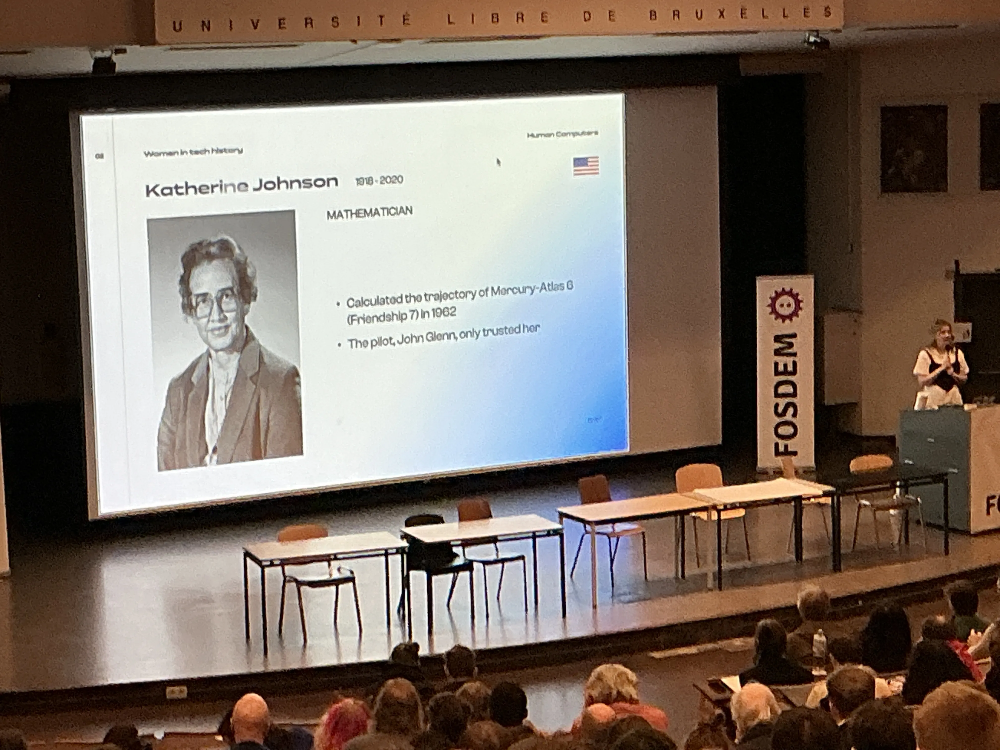

**Mary Jackson** was one of NASA's human computers at Langley and became NASA's first Black female engineer.

**Elizabeth Feinler** worked on ARPANET (started 1962, reality in 1969, first demo in 1972). She created the Resource
Handbook — no one knew what it was, but they needed it in six weeks. It was essentially the browser of ARPANET. She also
wrote WHOIS and participated in the birth of domain names.

**Sophie Wilson** — inventor of the ARM architecture.

**Radia Perlman** — inventor of the Spanning Tree Protocol (STP), which made the World Wide Web possible. She did it so
fast she had time to write a poem about it.

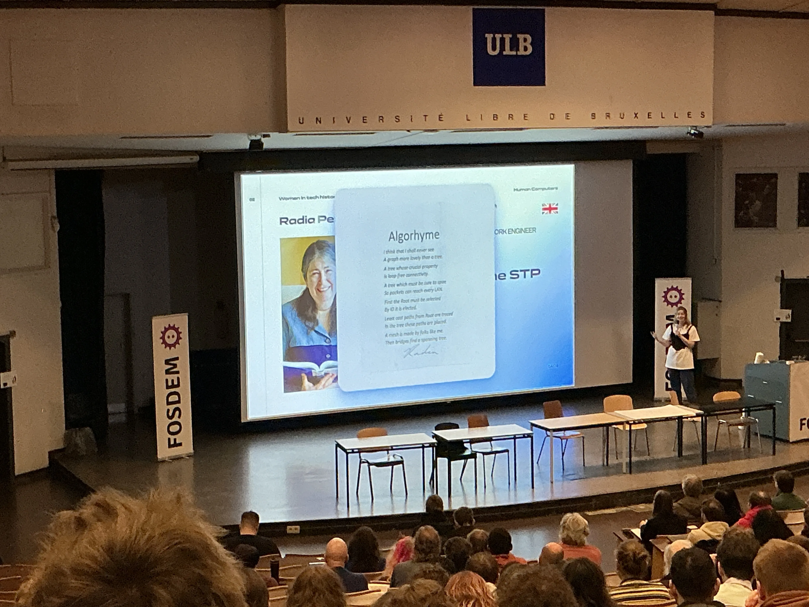

Rapid Spanning Tree Protocol and Multiple Spanning Tree Protocol are just extensions of STP.

The talk also covered a dubious 2000 study claiming to show girls are less interested in maths and science — boys looked
at objects, girls at faces, and researchers drew wild conclusions from that.

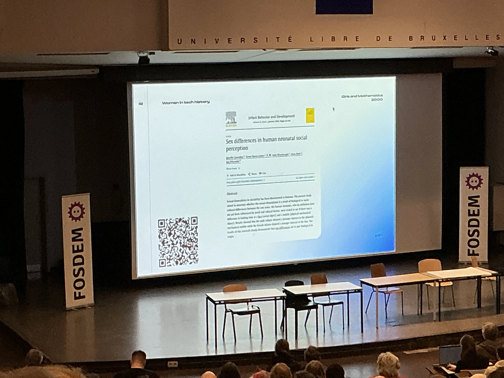

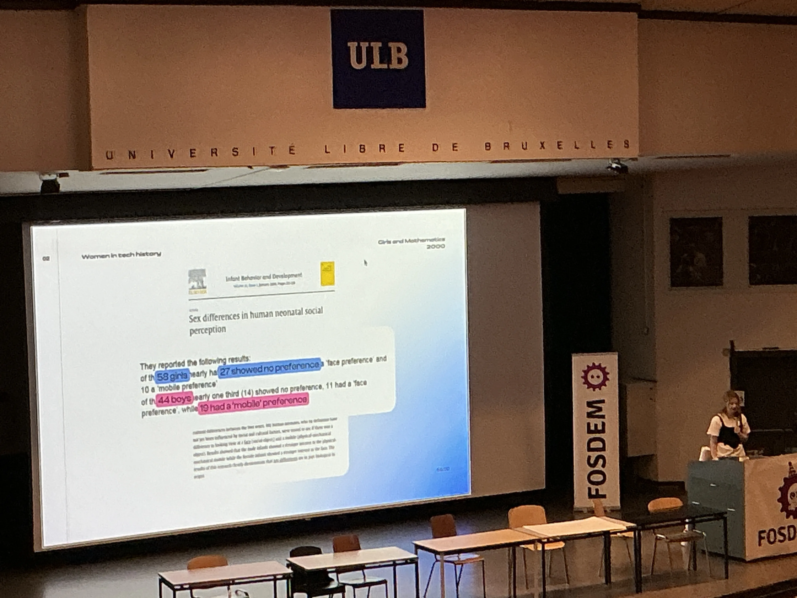

The numbers were rubbish, but the media widely shared them despite academics saying the results couldn't be replicated.
As the speaker put it: "I'm not good at maths" does not equal "I'm not interested in maths."

### [Rust for Linux](https://fosdem.org/2025/schedule/event/fosdem-2025-6507-rust-for-linux/) — [Miguel Ojeda](https://fosdem.org/2025/schedule/speaker/miguel_ojeda/)

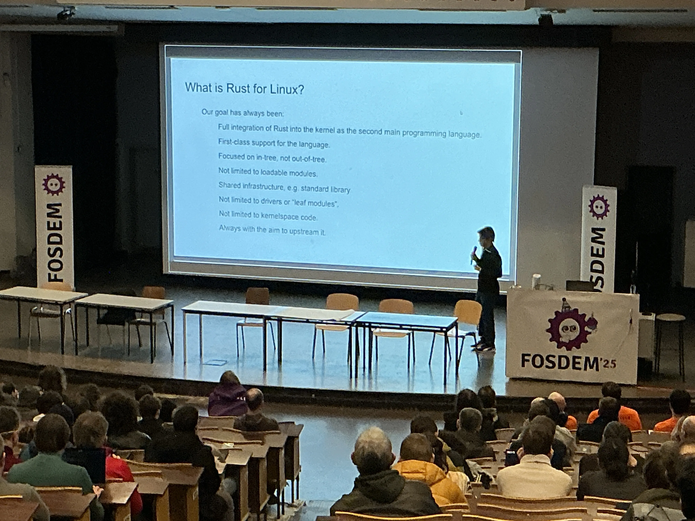

Rust is currently used for drivers in the Linux kernel: Phy, Null block, DRM panic screen QR code, and Android Binder.
NVMe and GPS drivers are upstream.

C and C++ are inherently unsafe. Rust is memory-safe, and the hope is it will reduce the number of logic bugs in kernel
code.

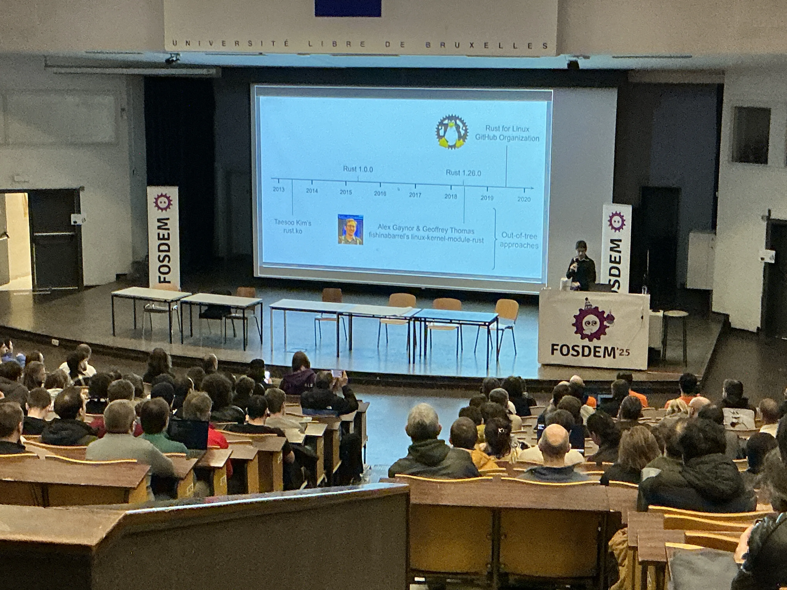

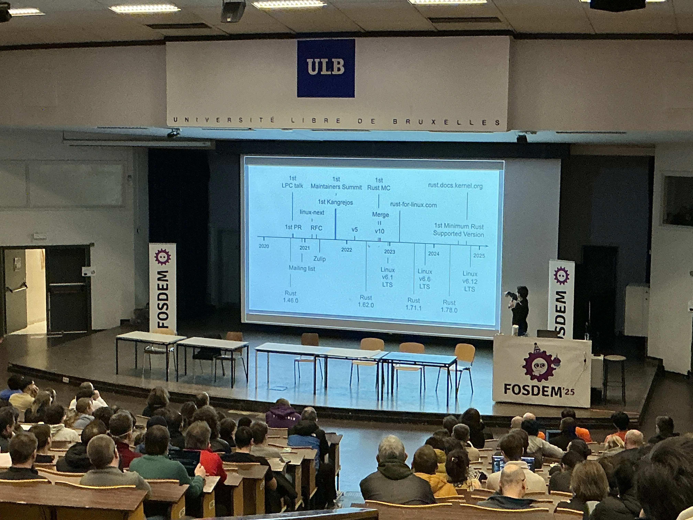

An overview of the timeline and the team behind the project. On the GCC front, gccrs is a new frontend for Rust in GCC,
with planned full Rust support.

Kernel developers had a range of opinions:

> "2025 will be the year of Rust GPU drivers… Rust is here to stay in this part of the kernel."
>
> "One of the most exciting developments… potential to attract new devs… will take time."
>
> "Needs to be careful not to overload maintainers."
>
> "Rust's biggest weakness is that relatively few people know it."
>
> "C is your dad's language."
>
> "Uphill battle… longer term gains to be had."
>
> "I don't want to go back to C development ever again."

Red Hat, Samsung, and Google all have multiple developers dedicated to Rust for Linux.

### [Rewriting the Future of the Linux Essential Packages in Rust?](https://fosdem.org/2025/schedule/event/fosdem-2025-6196-rewriting-the-future-of-the-linux-essential-packages-in-rust-/) — [Sylvestre Ledru](https://fosdem.org/2025/schedule/speaker/sylvestre_ledru/)

The uutils/coreutils project: 530 contributors, 1.3k forks, 18k stars, 499 of 617 tests passing in the GNU coreutils
test suite. They're production-ready and support a lot of platforms, including WASM.

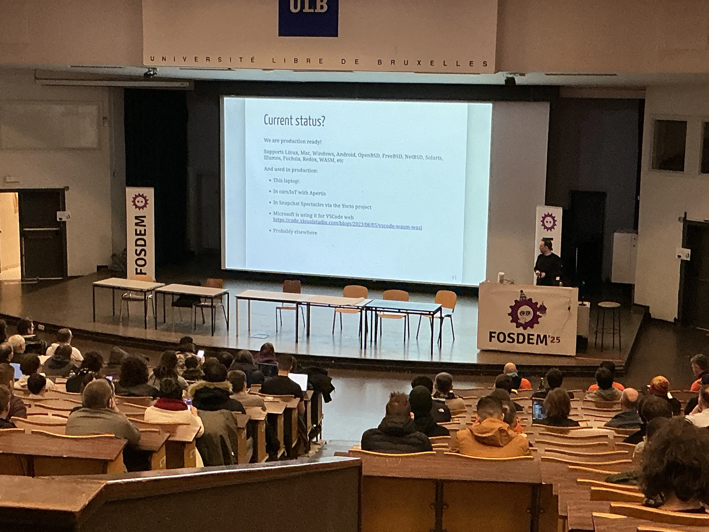

Rust is great for security, parallelism, and performance — and it's not about the license. It's very portable: write
once, run everywhere. Great ecosystem. Roughly 6× speed improvement. You can use Rust's tooling to profile and debug
issues.

### [How We Built a New Powerful JSON Data Type for ClickHouse](https://fosdem.org/2025/schedule/event/fosdem-2025-6351-how-we-built-a-new-powerful-json-data-type-for-clickhouse/) — [Pavel Kruglov](https://fosdem.org/2025/schedule/speaker/pavel_kruglov/)

An overview of column-oriented vs row-oriented databases and why column-wise storage is better for time series and data
analytics. The data models of traditional databases don't match well with JSON — fixed schemas vs schema-less data.
Dumping JSON into string fields won't work or scale.

The approach: convert JSON paths to columns. But there are challenges:

1. Documents with no common paths lead to an explosion of column count
2. Shared paths but different types have no direct database equivalent

The **Variant** data type solves challenges 2 and 3 — it's one of multiple data types or null, using a discriminator
representing the value's type and an offset structure for position in the subtype column.

The **Dynamic** data type is the same as Variant but without needing to specify subtypes in advance. Remaining values
are stored as `<datatype_type><value>`, with a small query-time cost. This solves challenge 1.

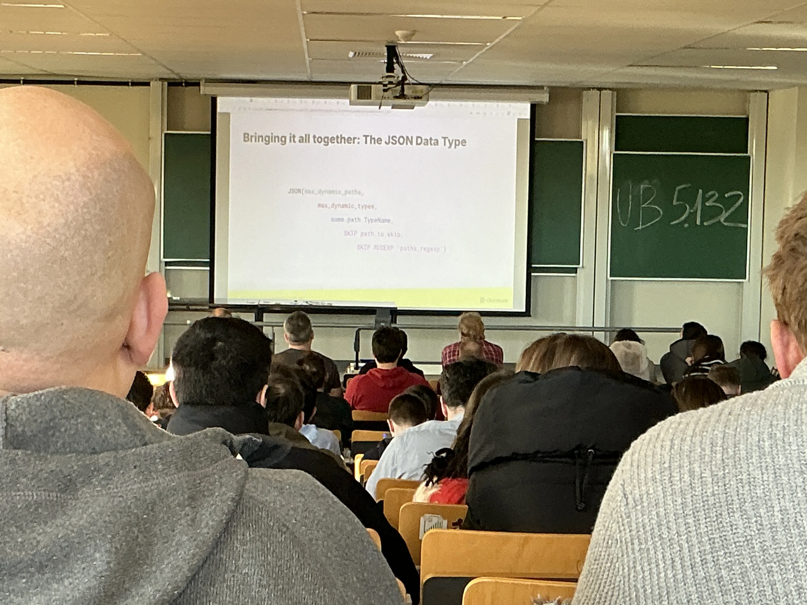

The JSON type can be configured with max paths as sub-columns, max types per path, paths that should always be stored as
sub-columns, and paths to exclude.

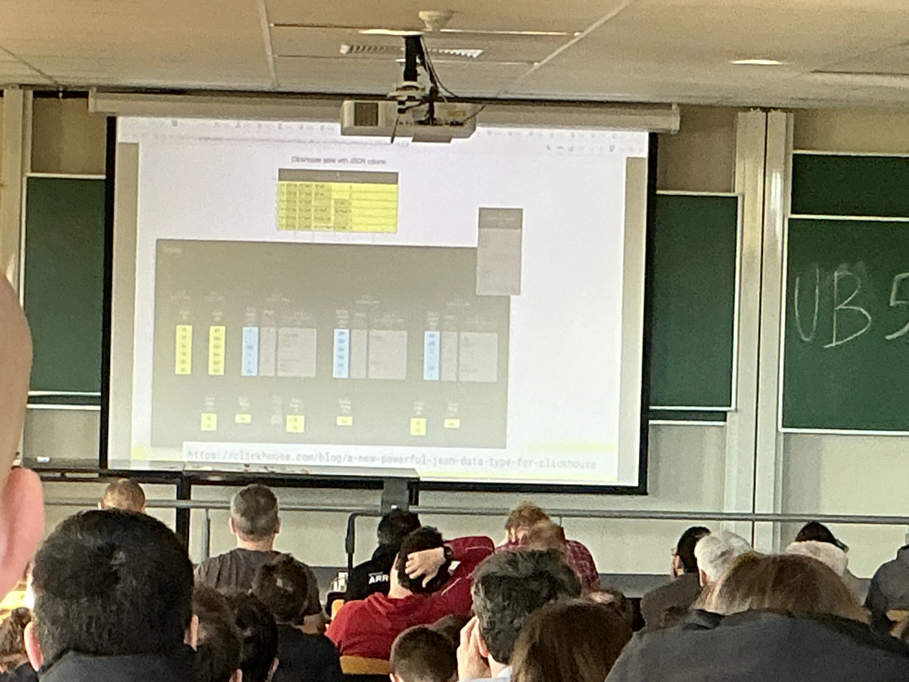

Performance claims: 10× faster than Elasticsearch, 4000× faster than DuckDB and MongoDB, 5000× faster than Postgres.

## Day 2 — Sunday

### [Rust, RPMs, and the Fine Art of Dependency Bundling](https://fosdem.org/2025/schedule/event/fosdem-2025-5570-rust-rpms-and-the-fine-art-of-dependency-bundling/) — [Dave Cherrie](https://fosdem.org/2025/schedule/speaker/dave_cherrie/)

The story of packaging bpfman (a Rust package) for Fedora. In general, packages should not use bundled crates or
dependencies — according to both Fedora policy and Cargo best practices.

They used `rust2rpm` to start, then worked their way down the dependency chain, finding missing or wrong versions. Over
200 new dependencies were required for bpfman, so they bundled deps instead.

`rust2rpm` could handle vendoring but couldn't handle patching. They resorted to ugly scripts to patch vendor deps, ran
into checksum mismatches, and the p434 curve wasn't allowed in Fedora for legal reasons.

Enter `rust2rpm-vendor`, written by the Rust SIG to help generate specs. It's in Python and uses patch files for
patching `Cargo.toml`. They had a command in the spec to remove checksums, but it got mangled. Broken licenses and
checksums were just `sed`'d away.

Eventually they got there, but it was very painful: identify vendor deps → apply patch → repackage → push. The advice:
try not to use vendoring, but you can if you need to. openSUSE vendors all Rust packages to save time.

### [Finding Anomalies in the Debian Packaging System to Detect Supply Chain Attacks](https://fosdem.org/2025/schedule/event/fosdem-2025-5224-finding-anomalies-in-the-debian-packaging-system-to-detect-supply-chain-attacks/) — [Jonas Dötsch](https://fosdem.org/2025/schedule/speaker/jonas_dotsch/)

Supply chain attacks are increasing every year. The talk used the `xz` backdoor as a case study — malicious code was
injected through the build system, hidden using test files and values. It was only detected by coincidence.

A walkthrough of the hack and how it got in, then a discussion of **Supply Graph** — a tool to capture and trace compile
commands through the build process.

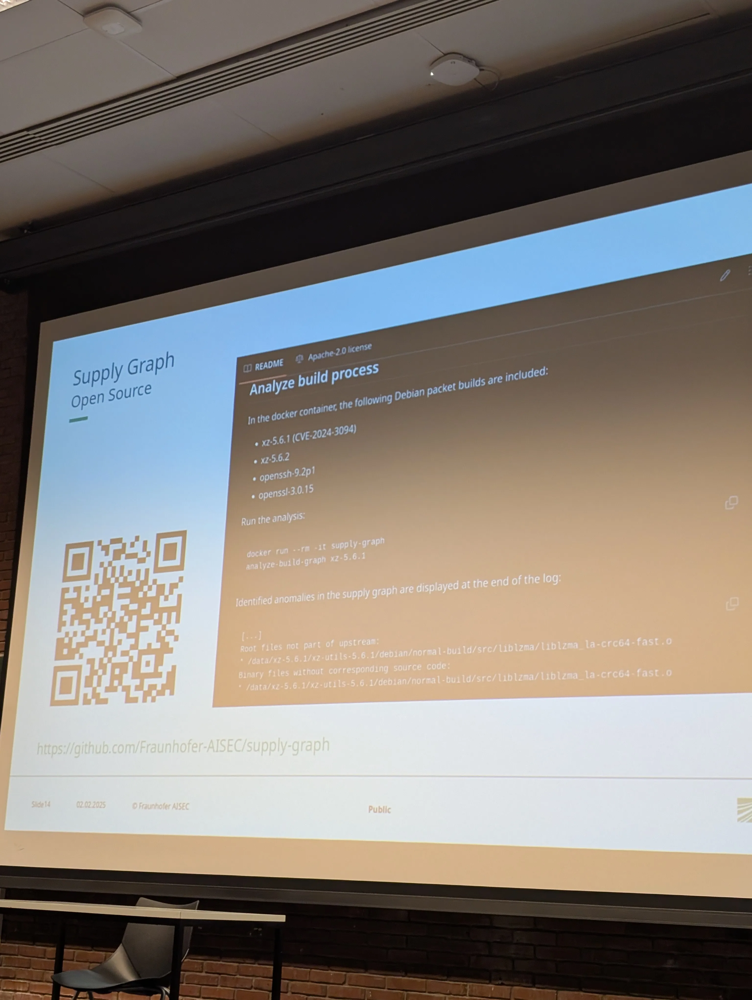

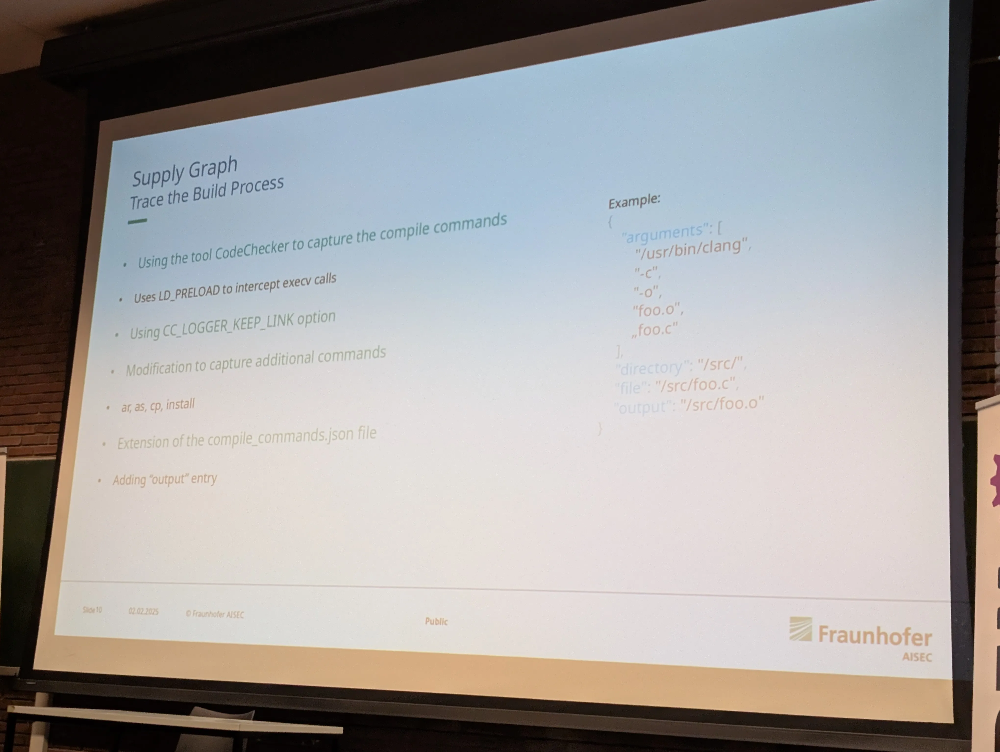

Limitations include flaky traceability, code generation, Perl scripts generating ASM, and protobuf.

### [Lessons Learned from Integrating SBOM in a Supply Chain](https://fosdem.org/2025/schedule/event/fosdem-2025-5784-lessons-learned-from-integrating-sbom-in-a-supply-chain/) — [Clément Music](https://fosdem.org/2025/schedule/speaker/clement_music/)

Using Red Hat's redpesk for IoT. The challenges: where to collect information from in the build system, how to merge
SBOMs from Rust, Go, and Node, and how to leverage information in RPMs and image manifests. They relied on the Red Hat
CVE database with patches from other sources.

### [What Can We Learn from Formula 1 Incident Management](https://fosdem.org/2025/schedule/event/fosdem-2025-6599-what-can-we-learn-from-formula-1-incident-management/) — [José Roque](https://fosdem.org/2025/schedule/speaker/jose_roque/)

Using F1 pit stop incidents to illustrate how to manage incidents and resolve them as quickly as possible. You need to
make fast decisions with limited information.

Key lessons from F1 applied to tech incident management:

- **Telemetry alone isn't enough** — they had telemetry but no one looked at what needed to be fixed. Incidents will
  happen; you need to be comfortable making decisions without the full picture.
- **Clear communication** — the right information to the right people at the right time.
- **Defined processes** — reduce chaos with a consistent, rapid response plan created before incidents happen.
- **Teamwork** — builds a more resilient and skilled team.
- **Stay calm** — train your team to handle the stress of incidents. A calm mind makes better decisions.
- **Technical proficiency** — skills mean stronger response. The right tools empower teams to resolve effectively.
- **Postmortems** — they're about learning. Focus on fixing the problem, not assigning fault.

Video of the F1 repair: <https://youtu.be/IGwm1QmwN9s>

### [Zero-Code Distributed Traces for Any Programming Language](https://fosdem.org/2025/schedule/event/fosdem-2025-5028-zero-code-distributed-traces-for-any-programming-language/) — [Nikola Grcevski](https://fosdem.org/2025/schedule/speaker/nikola_grcevski/)

Project: [Beyla](https://github.com/grafana/beyla). Uses eBPF for zero-code distributed tracing.

The talk walked through several attempts to inject trace context automatically:

1. **Writing to process memory** — technically possible but a bad idea and doesn't work with SELinux.
2. **Scanning incoming packets** for HTTP headers — punch a "hole" in the HTTP header to write the `Traceparent`.
   Couldn't put it in the header as it broke where the kernel tracked offsets.
3. **Placing it in the tail** — the ACK came back with the wrong size. They tried tracking the added memory and removing
   that much from the response. "Not great, not terrible."
4. **eBPF socket filter** — can't modify content directly, but _can_ add space. Used a two-step approach: one to
   increase the size, one to add the header text.

   That approach doesn't work for encryption or HTTP/2.

5. **Encoding trace data in IP headers** — not enough space to encode everything, so they only sent trace IDs. On
   ingress, span IDs were generated and could only be decoded by the eBPF code. Doesn't work with other SDKs or L7
   proxies.

### [O11y-in-One: Exploring a Unified Telemetry Database](https://fosdem.org/2025/schedule/event/fosdem-2025-5960-o11y-in-one-exploring-a-unified-telemetry-database/) — [Robert Hodges](https://fosdem.org/2025/schedule/speaker/robert_hodges/)

OpenTelemetry doesn't include a backend, and six is the typical number of observability tools a company has installed.
Disparate data leads to mistakes.

What are we actually storing? Signals (metrics, traces, logs, profiles, events), resource metadata (service info,
region, versions), dependency graphs, network topologies, snapshots, deltas, and configuration.

No silver bullet, but ClickHouse comes close. It's SQL-compatible, massively scalable, and fast. Telemetry is WORM
(write once, read many). B-trees optimise for reads but are expensive for inserts — not great for tracing. ClickHouse
uses MergeTrees instead: key-value in memory, compressed and optimised in the background. Columns instead of key-value
make writes faster, great for time-ordered data, easy to clean up, and cost-effective due to compression.

ClickHouse features for observability:

- Materialised views
- TTL
- Tiered storage
- Grafana datasource
- Jaeger integration
- Loki compatibility
- Kafka table engine for ingestion
- OTel exporter in the collector

Low cardinality support means millions of series are easily handled with horizontal scaling.

Challenges: SQL is not PromQL (though arguably that's a good thing), it can seem complex for small data volumes
(debatable — it works well at all scales), and it's not a turnkey solution — it's just a storage engine.

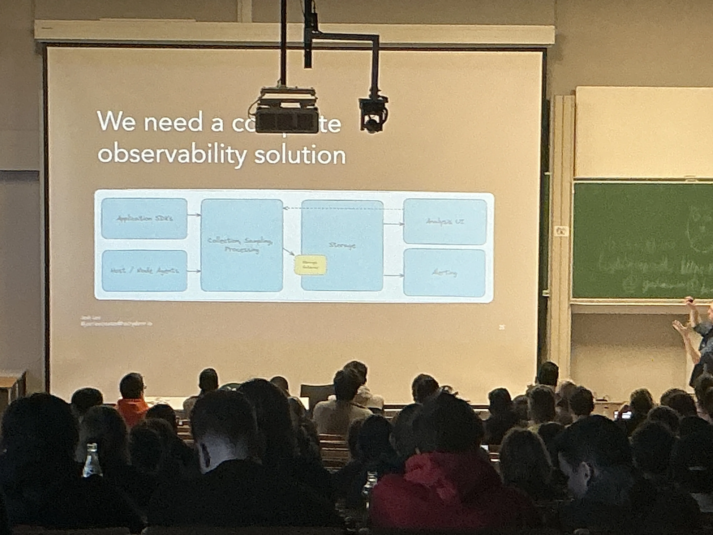

Turnkey solutions built on ClickHouse: SigNoz, Coroot, qryn, and HyperDX.

**Coroot**: health monitoring, service maps, traces, deployments, and cost tracking. Uses an eBPF node agent and an OTel
collector with the OTel schema.

**qryn**: a LogQL, PromQL, and TempoQL proxy for ClickHouse. Uses its own collector and exposes Tempo, Loki, and
Prometheus-compatible endpoints. Uses materialised views to manage data querying.

ClickHouse also supports bloom filters for full-text search and ZSTD compression.

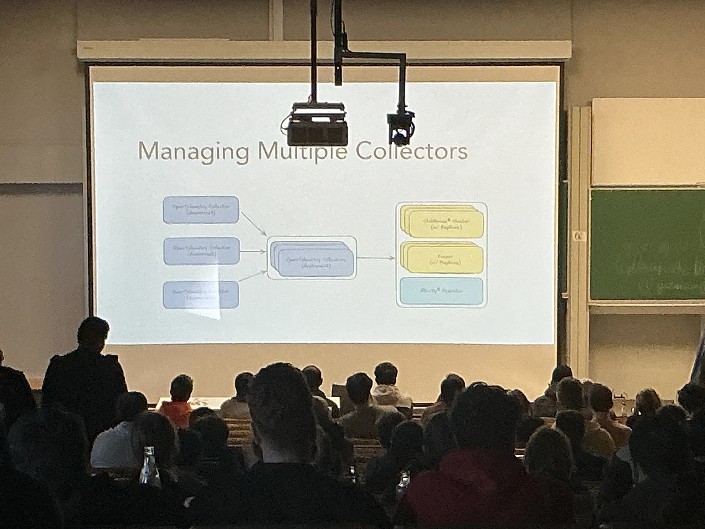
