## Introduction

In early October I attended SREcon EMEA 2025 in Dublin for the second year running. The conference was back at the
Convention Centre Dublin, and this year's programme leaned heavily into AI infrastructure, networking fundamentals, and
the perennial question of how to make things reliable when everything is on fire.

These are my notes and references from the talks I attended. As always, I'd recommend watching the actual talks for the
full picture — my notes only capture what stuck with me on the day.



## Tuesday, 7 October

### MLOps 2025: A Journey into the Past and the Future

> Alejandro Saucedo, Zalando —
> [MLOps 2025: A Journey into the Past and the Future](https://www.usenix.org/conference/srecon25emea/presentation/saucedo)

A walk through the history of ML in production. The industry went from deploying notebooks straight to prod — data
scientists building production systems without the expertise to run them — to something slightly more structured, though
we're not all the way there yet.

The shift to LLMOps has brought a paradigm change, and people are forgetting about security in the rush. Meanwhile,
boring data fundamentals are more important than ever. Garbage in, garbage out. There's a proliferation of custom,
non-standard API wrappers for models, and little to no monitoring in many deployments.

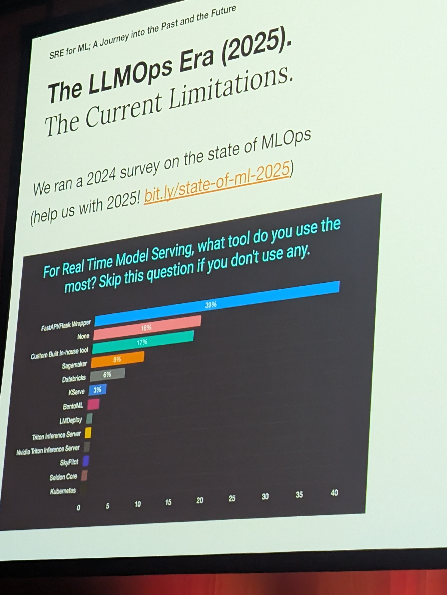

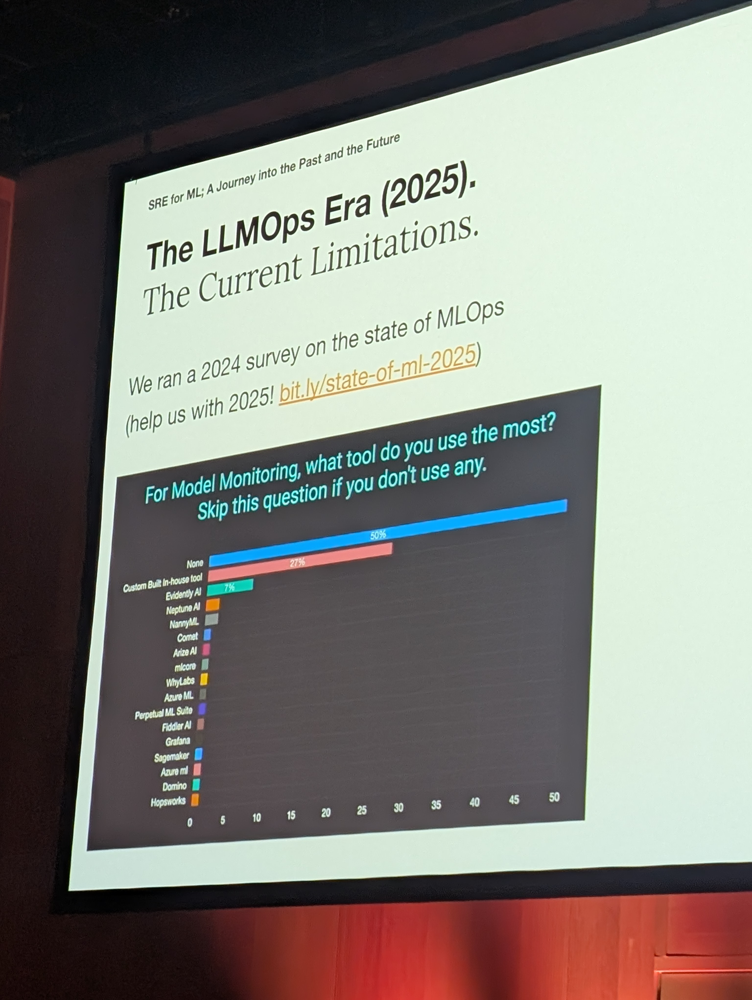

Looking ahead: we'll ship faster, observability will improve, and the subsidies will stop — which will force everyone to
get serious about efficiency.

### The Challenge of Making Large AI Clusters Reliable

> John Looney and Panos Christeas, Crusoe.ai —
> [Challenges of Making Large AI Clusters Reliable](https://www.usenix.org/conference/srecon25emea/presentation/looney)

Crusoe.ai is a "neocloud" built specifically for training LLMs. The hardware demands are enormous — more power, more
heat, better cooling. Traditional data centres can't provide what's needed, so they're building near wind and solar
farms, close to energy parks.

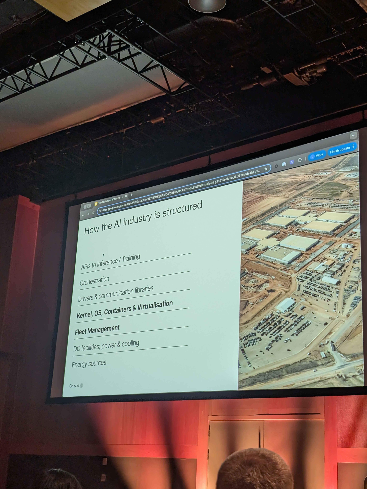

The classic "cattle, not pets" mantra applies, but with a twist: these aren't your $40 cattle. These are racehorses and
A5 Wagyu beef cattle. You can't just let them die and spin up replacements. Racehorses make crappy work hours, and cheap
compute makes terrible LLM training clusters.

Sources of failure are everywhere: NICs getting overloaded, no control over user workloads, running at the bleeding edge
of kernel features with unique bugs that are hard to upgrade around. Optics run hotter, HCAs overheat and throw PCIe
resets, and cables that are too long get bent and break.

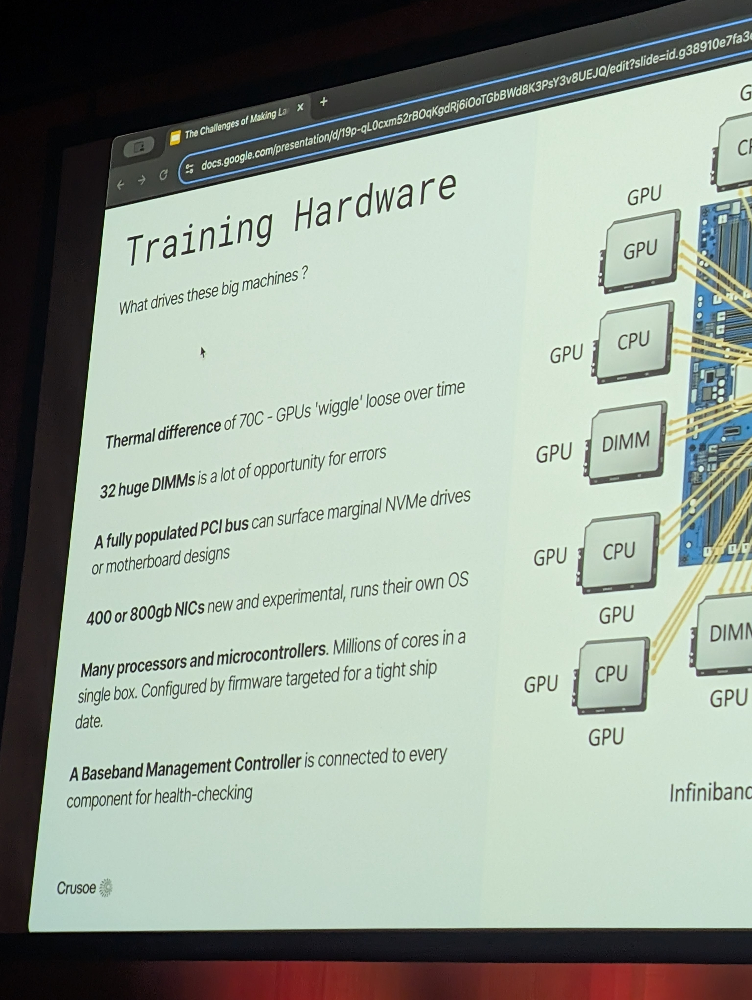

### ACK to the Future: TCP in 2025

> Philip Rowlands, Jane Street —
> [ACK to the Future: TCP in 2025](https://www.usenix.org/conference/srecon25emea/presentation/rowlands)

A fun talk full of TCP jokes. Covered TCP auto-tuning for window sizes — kernel-level settings that don't require
network-side changes. Entertaining and educational in equal measure.

### IPv6 in 2025: Quo Vadis?

> Alexandros Kosiaris, Wikimedia Foundation —
> [IPv6 in 2025: Quo Vadis?](https://www.usenix.org/conference/srecon25emea/presentation/kosiaris)

Wikipedia is projecting 100% IPv6 usage by 2045, currently sitting at around 40%. T-Mobile has been IPv6-only since 2014
using CLAT/PLAT translation. Meta, Microsoft, and Google are running parts of their networks on IPv6. Google's IPv4 vs
IPv6 usage fluctuates around 50%, and France is at 85%. GitHub still doesn't support IPv6.

### Fifty Shades of Caching and How LLMs Paint It Black

> Effie Mouzeli, Wikimedia Foundation —
> [Fifty Shades of Caching and How LLMs Paint It Black](https://www.usenix.org/conference/srecon25emea/presentation/mouzeli)

Two kinds of caches: private (browser) and public (CDN and friends). The talk opened with an overview of cache-control
headers and Wikimedia's architecture — two CDN layers (upload and text) built on HAProxy and Varnish.

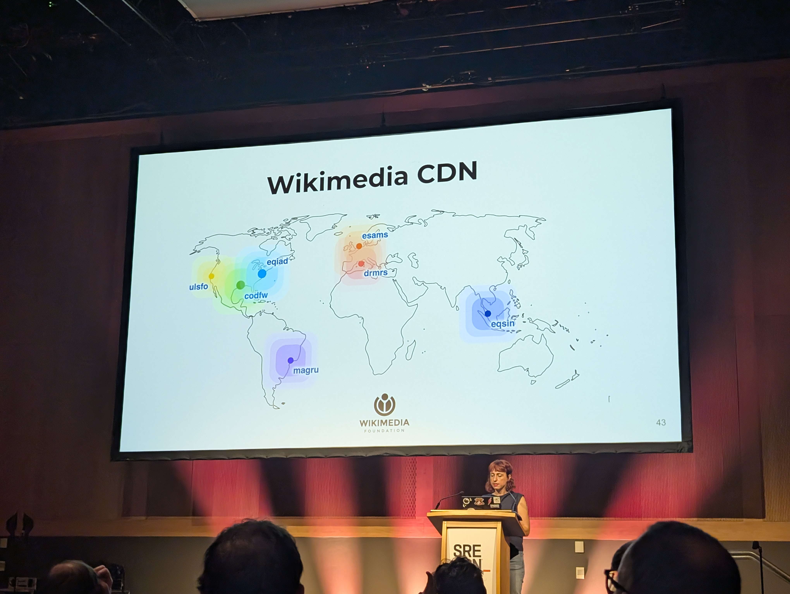

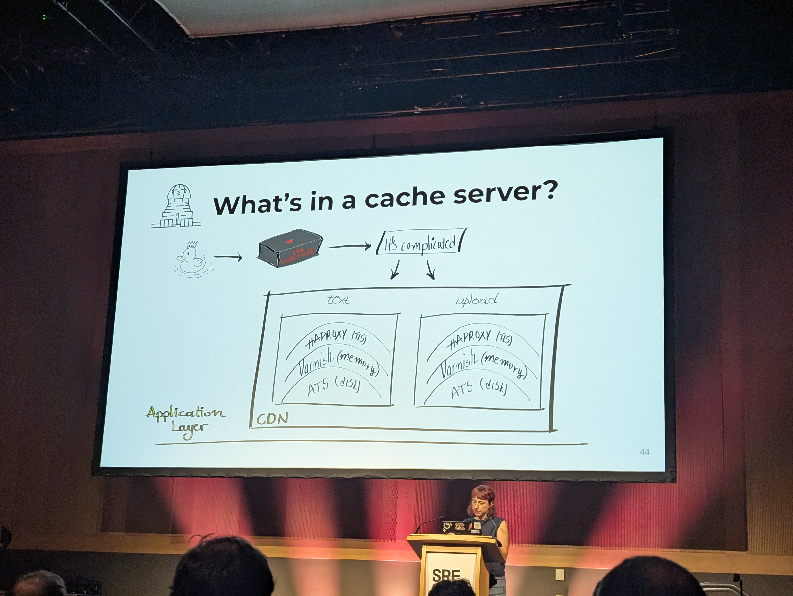

Cache hit rates vary by region, and what's popular depends on location. About twenty percent of the content accounts for
the majority of traffic. Application-level caching comes in two flavours: in-memory (fast, limited, volatile — hashmaps
and the like) and external caches (slower, scalable, resilient).

The problem is that current systems are optimised for human traffic patterns — organic patterns built to bend rather
than break.

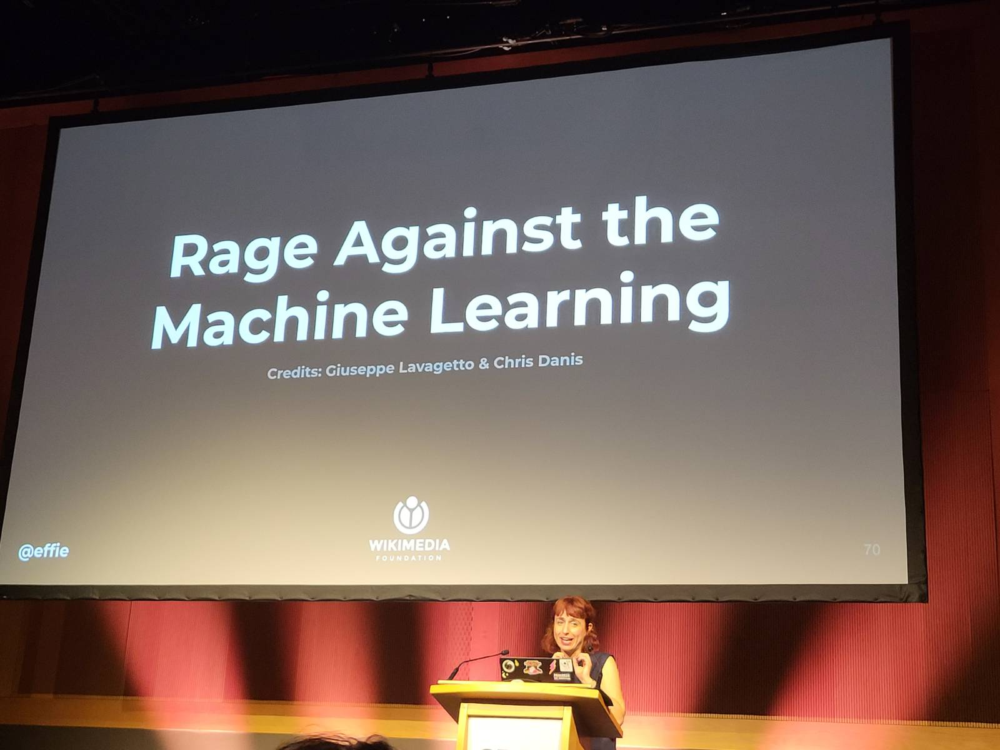

LLM crawlers and agents are increasing global web traffic dramatically. They're not just fetching HTML — they want media
and all the metadata too. They don't play nice: ignoring robots.txt, impersonating other LLMs, humans, and other bots,
and routing traffic through residential internet connections. The patterns are unpredictable, and we pay the bill.

You can't just cache everything — dynamic responses, cache pollution, and warm-up costs all get in the way. The current
defence is banning dumb crawlers, old user agents, and using WAFs, but bots are now being used to detect other bots, and
teams are still getting paged.

### The Computer Wants to Lose Your Data

> Chris Sinjakli, PlanetScale —
> [The Computer Wants to Lose Your Data](https://www.usenix.org/conference/srecon25emea/presentation/sinjakli)

A deep dive into the ways storage systems can silently lose your data.

**MySQL's double-write buffer:** Write-ahead logs clean up data after crashes. Logical data is broken into pages for
physical writes, and those pages need to be written atomically. Torn writes happen when hardware fails mid-write. The
double-write buffer keeps a good copy of each page as a safety net. You can skip it in specific cases — ZFS can make
atomic writes match the page size, and enterprise SSDs can do atomic writes at the page-size level on power failure.

**Postgres fsync:** Postgres used to retry on `EIO` fsync errors. The problem was that `EIO` errors would clear on the
next call — the kernel doesn't persist them indefinitely (it would be a memory leak). Postgres eventually decided to
crash on errors, letting the postmaster check files against the write-ahead log on recovery. The kernel was later
updated to propagate fsync errors to other processes with open file descriptors. MySQL and MongoDB had the same bad
retry-on-`EIO` pattern.

**Lessons learned:** Disks and filesystems have terrible APIs. They will lie to you. Slowing things down makes them more
reliable. The practical advice? Just pay someone to deal with it.

---

## Wednesday, 8 October

### HyperRouter: Lessons Learnt from Building an L4 Load Balancing Service

> Linhua Tang and Jayaganesh Kalyanasundaram, Huawei Ireland Research Center —
> [HyperRouter: Lessons Learnt from Building an L4 Load Balancing Service](https://www.usenix.org/conference/srecon25emea/presentation/tang)

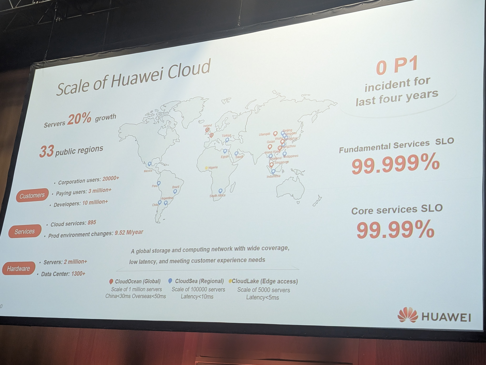

HyperRouter is a multi-tenanted software load balancer. Huawei uses Orion for L7 (TLS termination, HTTP header/body
parsing, security policies, response transformation), but Orion isn't resilient to node failures or scale-up/down
because ECMP disrupts healthy TCP connections. HyperRouter handles L4 with stateless packet forwarding, consistent
hashing, connection tracking, and direct server return to reduce egress overhead.

The objectives: high performance close to line-rate, high scalability for Huawei Cloud's billions of concurrent TCP
connections, high reliability with zero expected downtime, and future-proofing for evolving needs.

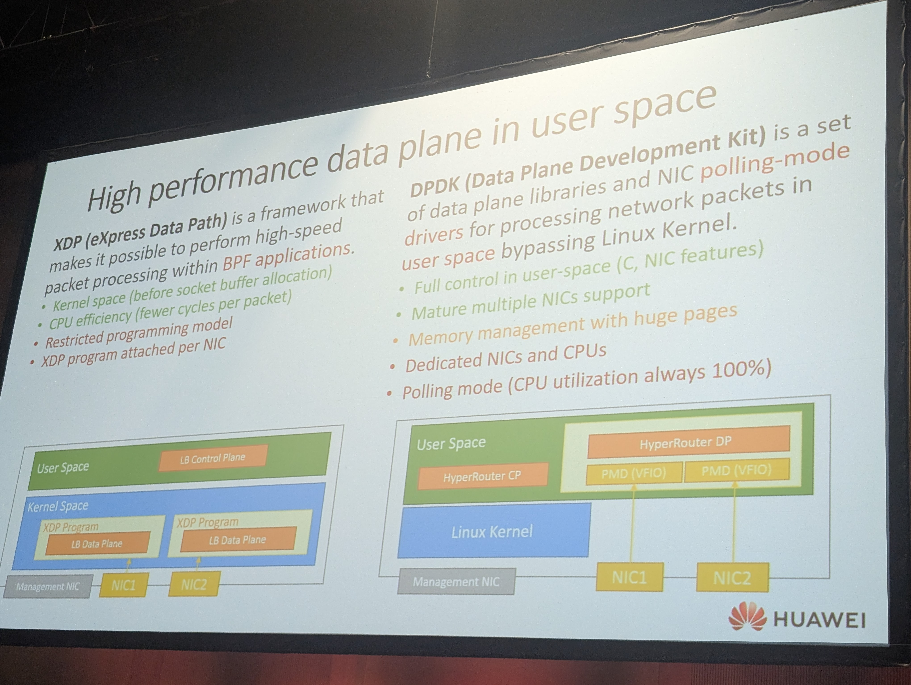

The control plane is peer-to-peer with eventually consistent configuration. Every node holds all the data, connected via
bidirectional gRPC. They formally verified the P2P communication protocol.

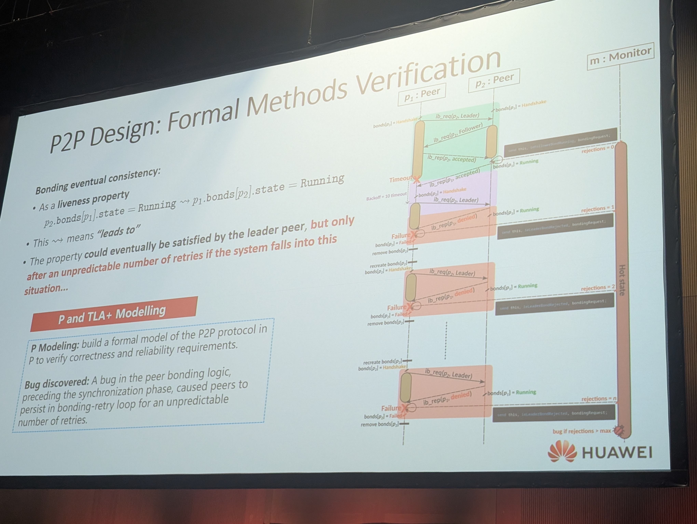

Shuffle sharding isolates the blast radius. They defined critical user journeys to determine what to observe, built
traces around those journeys, and can now see real-world request performance with per-component metrics.

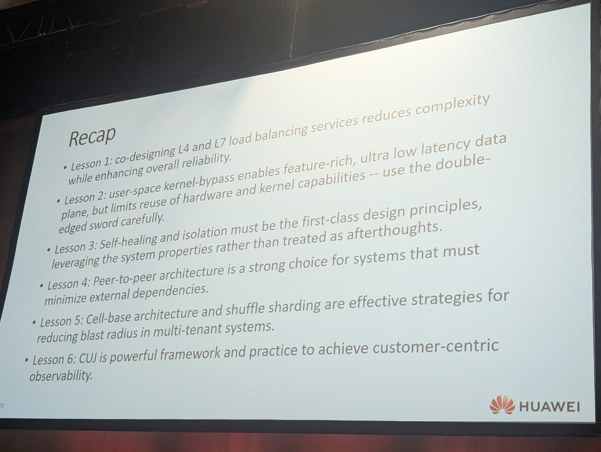

### SRE for AI and AI for SRE

> Todd Underwood, Anthropic —
> [SRE for AI and AI for SRE](https://www.usenix.org/conference/srecon25emea/presentation/underwood)

A play in three acts. Don't write a book.

**"Claude got dumber"?** In early August, users started claiming the model had degraded. There was no correlation with
anything other than time — no intentional degradation, no correlation with model changes. It turned out to be multiple
minor problems, not one single issue. Quality is the true SLO.

Scraping data used to be hard; now it's easy. Training is essentially a lot of computers sharing a giant shared map —
5,000 nodes of very new hardware that doesn't all work, may corrupt data, and may be slow. The hardware and algorithms
are non-deterministic, with a 16% performance cost to make them deterministic.

Models don't fit on one node. Traffic doesn't fit in a single data centre or cloud. Serving runs on multiple hardware
platforms for performance, cost, and availability. Context caching is load-bearing in LLMs — needed to avoid shipping
large text payloads back and forth. The systems aren't stateful, but they're not stateless either, thanks to caching and
long-lived requests (up to 10 minutes).

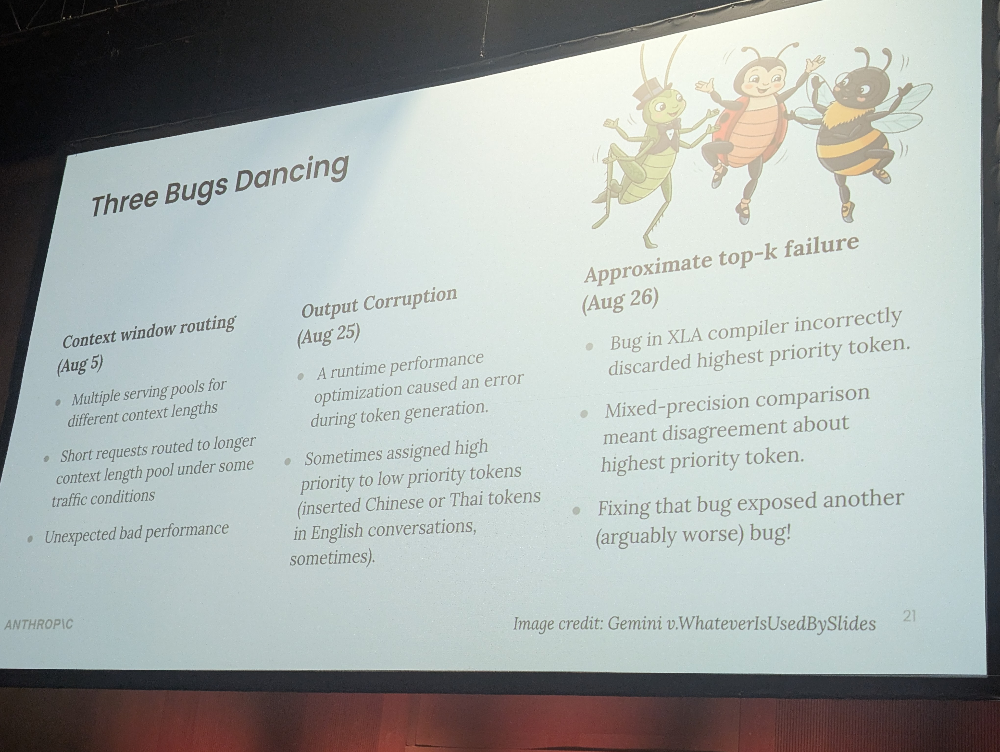

**Bug #1:** Hard to detect — only 0.8% of requests affected, different symptoms on different platforms,
traffic-dependent. Hard to troubleshoot — quality evals didn't show degradation, and privacy policies restricted access
to large pools of prompts.

**Bug #2:** A performance change led to the misassignment of high-value tokens to low-value tokens. Understanding the
scope of a bug matters.

**Bug #3:** Maths is hard.

### Training New Incident Commanders: Pokémon Style

> Laura de Vesine, Datadog —
> [Training New Incident Commanders: Pokémon Style!](https://www.usenix.org/conference/srecon25emea/presentation/devesine)

The training needed to be both theoretical and practical, didn't need to be service-specific, and — what if it was
entirely non-technical? The idea: rely on common-sense knowledge, make it look like an incident, have a reasonable
solution, keep it challenging and dynamic, and encourage communication.

The scenario: a dangerous Charizard (described by appearance, not name). You need a "fire" Pokéball to catch it, but
there's none in inventory. The manager suggests a wrong solution. Everyone wants to know what's going on. Roles include
on-call, team expert, team manager, inventory team on-call, and a home team member.

Participants learn through experience and guided reflection. Ninety percent of trainees report increased confidence.
Twenty to thirty percent agree to become future facilitators. Ad-hoc observations show improved incident handling:
better communication, more awareness, and better presence.

### Taming the Cost of Telemetry: How Riot Games Reined In Observability Costs

> Maxfield Stewart, Riot Games —
> [Taming the Cost of Telemetry: How Riot Games Reined In Observability Costs](https://www.usenix.org/conference/srecon25emea/presentation/stewart)

Riot Games was producing 3.8 PB per month of metrics and logs — a 60/40 split of logs to metrics, most of it unused.
They had a fixed-price unlimited-usage deal coming to an end, with projected growth of 50–100% and costs going from
seven figures to eight.

Building things yourself is only cheap because it's not competitive. They used Datadog, with Vector Collector as a proxy
to apply sampling and standards, routing traffic over a private link. For new services: eBPF monitoring only, 1% of logs
sampled, custom metrics sampled in QA and blocked in prod. Production releases were reviewed by the SRE team for metric
and log budgeting. Machine metrics used CloudWatch.

The result: logs down to 350 TB per month and a 15% lower monthly run rate.

---

## Thursday, 9 October

### CPU Utilization: The Hidden Cost of Running Hot

> Andreas Strikos, GitHub —
> [CPU Utilization: The Hidden Cost of Running Hot](https://www.usenix.org/conference/srecon25emea/presentation/strikos)

Reference:
[Breaking Down CPU Speed: How Utilization Impacts Performance](https://github.blog/engineering/architecture-optimization/breaking-down-cpu-speed-how-utilization-impacts-performance/)

What is performance? Latency (time to serve a request), capacity (sustained max throughput), and efficiency (how
economically you process a request). Little's Law ties them together: `L = λ × W` — the number of active requests equals
the arrival rate times the latency per request.

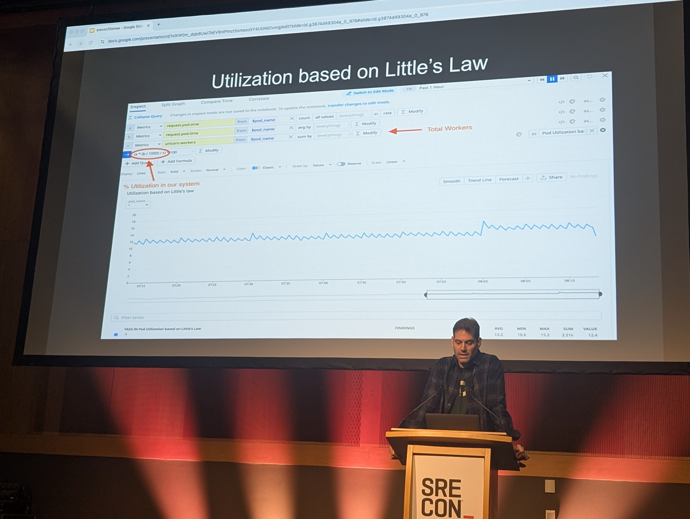

Theory in practice: latency grows as load grows. GitHub created a performance team to build efficient systems at scale.
CPU utilisation and latency are heavily linked. They analyse performance by CPU family and instance type, sending
production traffic to an isolated performance testing environment for real-user metrics — essentially canaries for
performance testing.

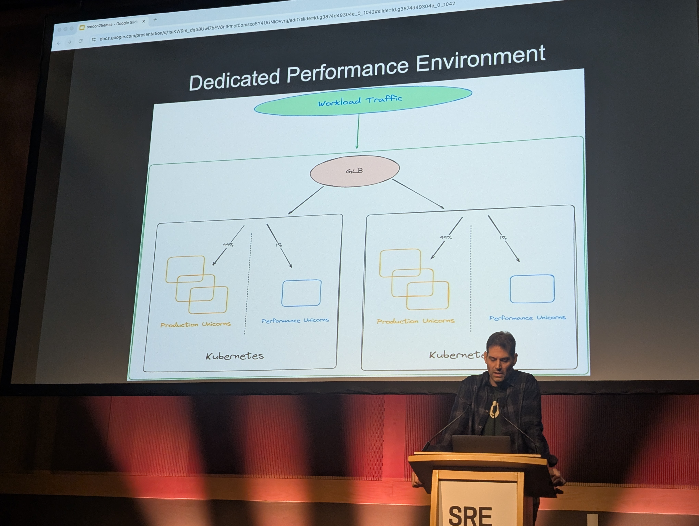

CPU metrics come from the host via `/proc/stat` and `/sys/devices/system/cpu`: total CPU idle/busy time, per-core
utilisation, and per-core current frequency.

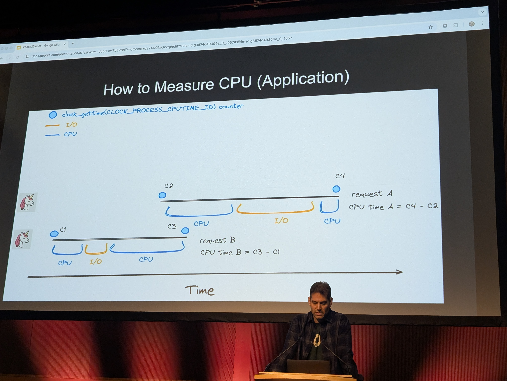

The experiment: route moderate production traffic to a dedicated node, establish a baseline, maintain steady RPS, then
increase CPU utilisation on the host using `stress-ng`.

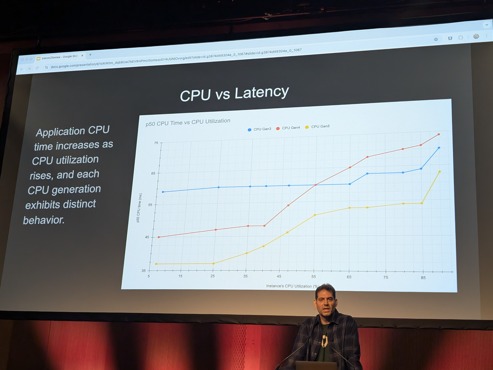

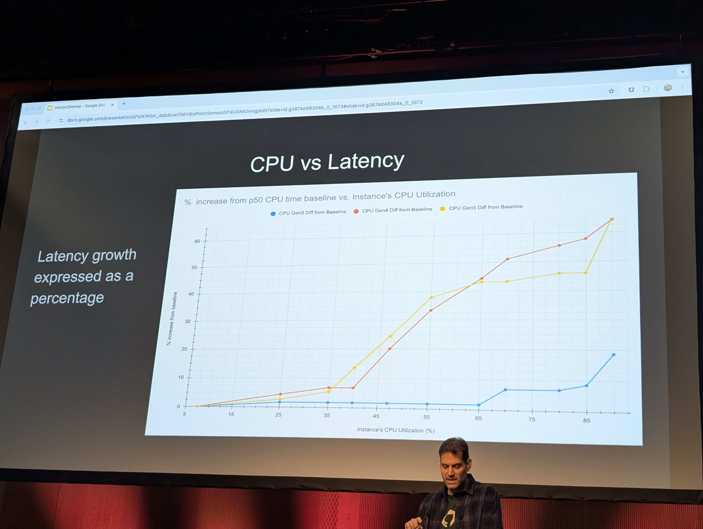

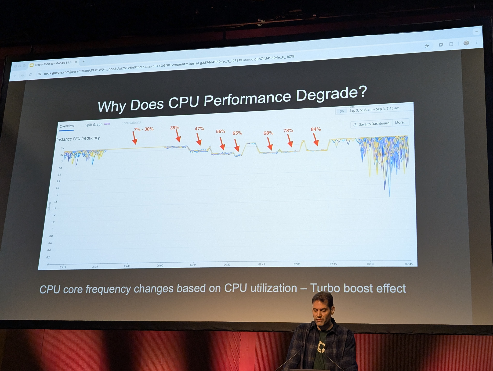

CPU drops frequency in response to sustained work, which paradoxically causes reported utilisation to drop.
Hyper-threading eventually plateaus — threads compete for resources, further dropping utilisation. When load average
exceeds the physical core count, expect contention. Disabling C-states caused utilisation to remain high with low
frequency and blocked Turbo Boost.

Key takeaways: an idle CPU wastes resources, but high CPU utilisation erodes performance, and poor performance drives
unnecessary scaling and over-provisioning. Find the utilisation sweet spot by measuring app and system CPU time at
varying levels, defining acceptable degradation based on user expectations, and plotting utilisation vs CPU time to find
the knee point. Select a threshold that maximises efficiency while staying within acceptable degradation.

### The SRE's Crystal Ball: Predicting System Performance with Queues and USL

> Aravindh Sampathkumar, Booking.com —
> [The SRE's Crystal Ball: Predicting System Performance with Queues and USL](https://www.usenix.org/conference/srecon25emea/presentation/sampathkumar)

Thinking in queues. Queues are everywhere, and queuing is non-linear — it's not intuitive. Queues occur even when
there's enough average capacity, because of high variance in arrival rates and service times.

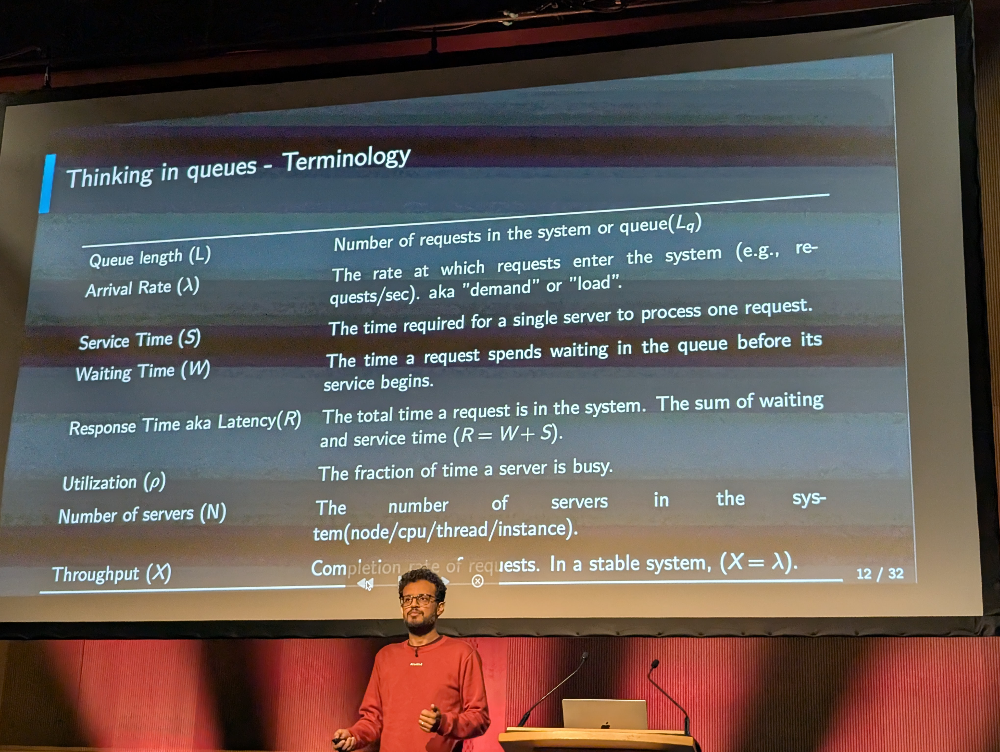

The golden signals through a queuing theory lens: latency is service time plus waiting time (utilisation drives waiting
time, and the coefficient of variation is a leading indicator); traffic as arrival rate (λ) is the demand driver; errors
are a symptom of overload; and saturation is high utilisation.

Little's Law again: `L = λ × W`. A worked example: arrival rate of 180 req/s, average service time of 50 ms, four server
pods.

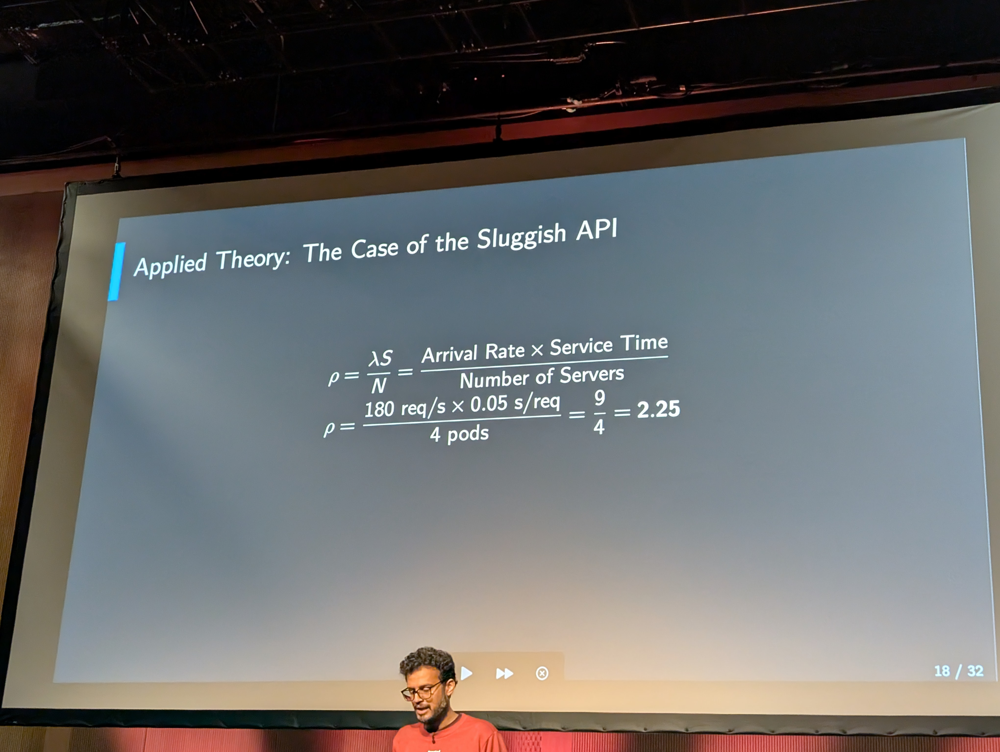

ρ = (180 × 0.05) / 4 = 2.25 — anything above 1 means queuing. Scaling to 8 pods gives ρ = 1.25, still over 1. You need
10 pods to get ρ = 0.95 and eliminate the queue.

The Universal Scalability Law models how throughput changes with concurrency, accounting for contention and coherency
overhead.

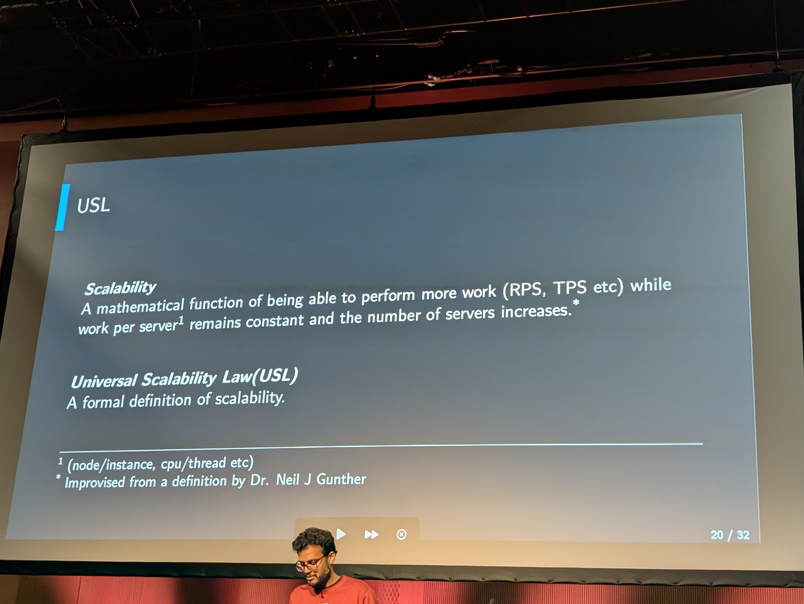

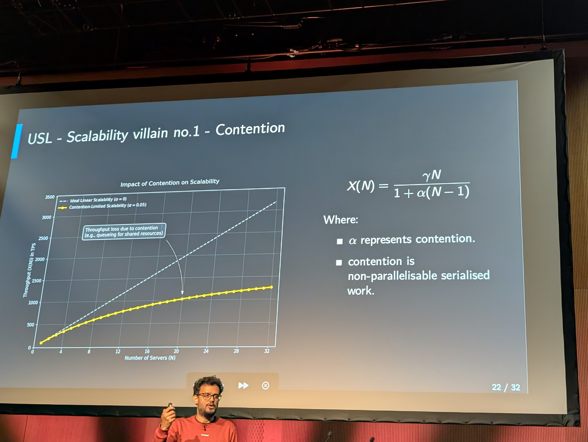

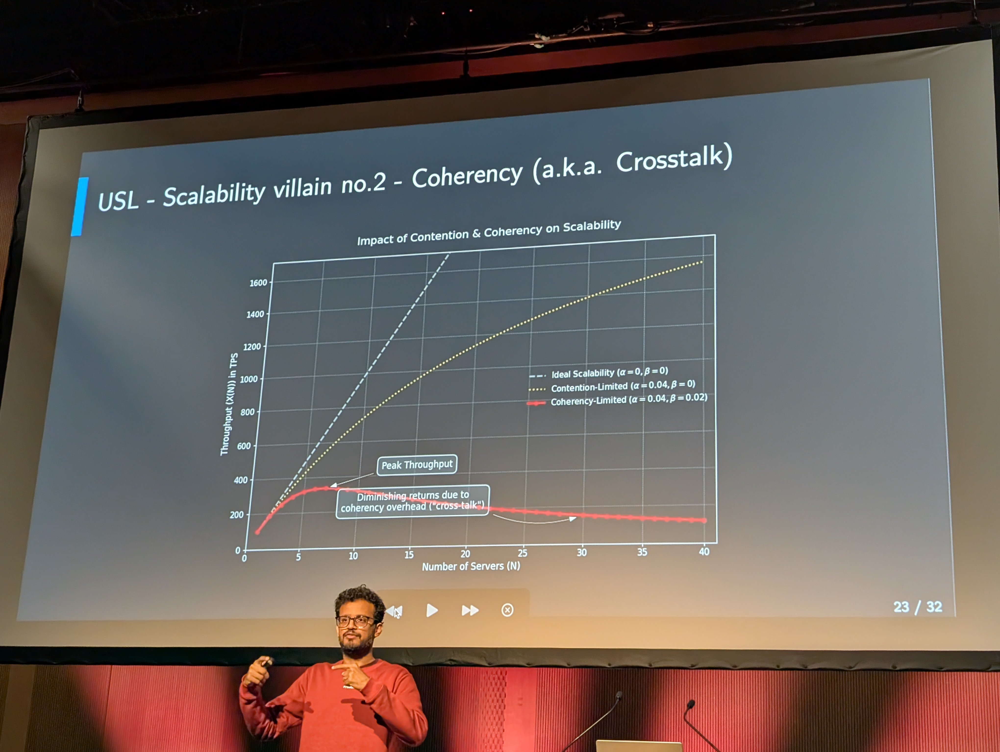

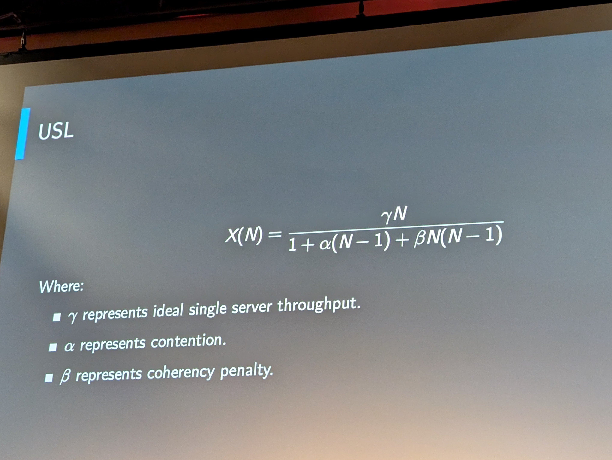

Limitations: noisy real-world data, distributed systems that are hard to model as aggregate functions, async and
event-driven architectures that resist modelling, a coherency factor that assumes 1:1 coordination, systems that behave
differently at scale, noisy neighbours in multi-tenant environments, and rate limits at dependencies.

Pitfalls: garbage in, garbage out; don't extrapolate too far into the future; maximum throughput is often not the actual
goal.

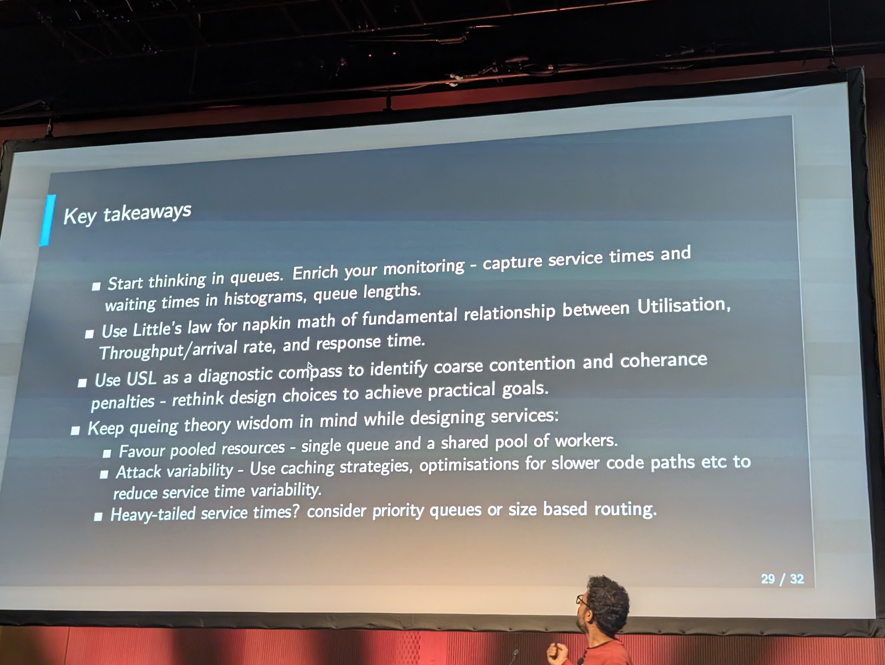
